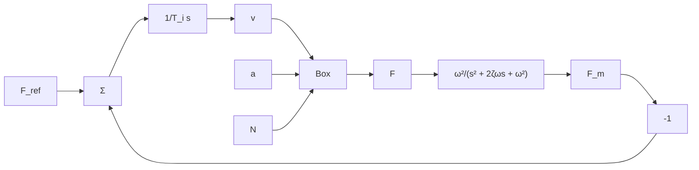
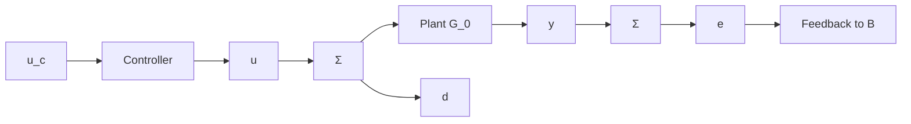

where $a$ is the depth of the cut, $v$ is the feed rate, $N$ is the spindle speed, $\alpha$ is a parameter in the range $0.5 < \alpha < 1$ , and $k$ is a positive parameter.

flowchart

Figure 1.25 Block diagram of a control system for metal cutting.

The steady-state gain from feed rate to force is

$$K = k \alpha a v ^ {\alpha - 1} N ^ {- \alpha}$$

The gain increases with increasing depth $\alpha$ , decreasing feed rate v, and decreasing spindle speed N. Assume that $\alpha = 0.7$ , k = 1, a = 1, $\zeta = 0.7$ , and $\omega = 5$ . Determine $T_{i}$ such that the closed-loop system shows good closed-loop behavior for N = 1 and a = 1.

(a) Investigate the performance of the closed-loop system when $N$ varies between 0.2 and 2 and $a = 1$ .   
(b) Repeat part (a) but for $a$ varying between 0.5 and 4 and $N = 1$ .

1.9 Consider the system in Fig. 1.26. Let the process be

$$G _ {0} (s) = \frac {K}{s + a}$$

where

$$K = K _ {0} + \Delta K \quad K _ {0} = 1a = a _ {0} + \Delta a \quad a _ {0} = 1$$

flowchart

Figure 1.26 Block diagram for Problems 1.9 and 1.10.

and

$$
\begin{array}{l} - 0. 5 \leq \Delta K \leq 2. 0 \\ - 2. 0 \leq \Delta a \leq 2. 0 \\ \end{array}
$$

Let the ideal closed-loop response be given by

$$Y _ {m} (s) = \frac {1}{s + 1} U _ {c} (s)$$

(a) Simulate the open-loop responses for some values of $K$ and $a$ .

(b) Determine a controller for the nominal system such that the difference between step responses of the closed-loop system and of the desired system is less than 1% of the magnitude of the step.

(c) Use the controller from part (b) and investigate the sensitivity to parameter changes.

(d) Use the controller from part (b) and investigate the sensitivity to the disturbance $d(t)$ when

$$
d (t) = \left\{ \begin{array}{c c} - 1 & 0 \leq t <   6 \\ 2 & 6 \leq t <   1 5 \\ 1 & 1 5 \leq t \end{array} \right.
$$
