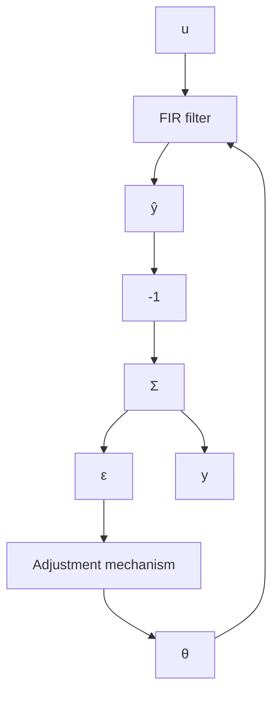

# Finite-Impulse Response (FIR) Models

A linear time-invariant dynamical system is uniquely characterized by its impulse response. The impulse response is in general infinite-dimensional. For stable systems the impulse response will go to zero exponentially fast and may then be truncated. Notice, however, that a large number of parameters may be required if the sampling interval is short in comparison to the slowest time constant of the system. This results in the so-called finite impulse response (FIR) model, which is also called a transversal filter. The model can be described by the equation

$$y (t) = b _ {1} u (t - 1) + b _ {2} u (t - 2) + \dots + b _ {n} u (t - n) \tag {2.33}$$

or

$$y (t) = \varphi^ {T} (t - 1) \theta$$

where

$$
\begin{array}{l} \theta^ {T} = \left( \begin{array}{c c c} b _ {1} & \dots & b _ {n} \end{array} \right) \\ \varphi^ {T} (t - 1) = \left( \begin{array}{l l l} u (t - 1) & \dots & u (t - n) \end{array} \right) \\ \end{array}
$$

This model is identical to the regression model of Eq. (2.1), except for the index t of the regression vector, which is different. The reason for this change of notation is that it will be convenient to label the regression vector with the time of the most recent data that appears in the regressor. The model of Eq. (2.33) clearly fits the least-squares formulation, and the estimator is then given by Theorem 2.3.

The parameter estimator can be represented by the block diagram in Fig. 2.3. The estimator may be regarded as a system with inputs u and y and output $\theta$ . Since the signal

$$\hat {y} (t) = \hat {b} _ {1} (t - 1) u (t - 1) + \dots + \hat {b} _ {n} (t - 1) u (t - n)$$

is available in the system, we can also consider $\hat{y}(t)$ as an output. Since $\hat{y}(t)$ is a predicted estimate of y, the recursive estimator can also be interpreted as an adaptive filter to predict y. The use of this filter is discussed in Chapter 13.

flowchart

Figure 2.3 Block diagram representation of a recursive parameter estimator for an FIR model.
