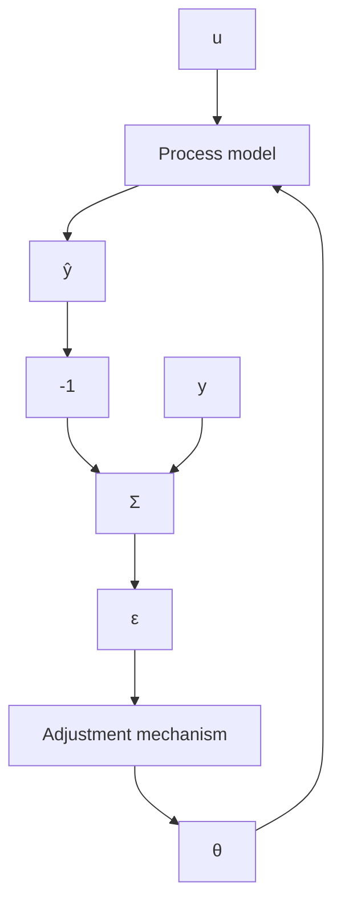

The method obtained is then called an output error method. To describe such a method, let u be the input and $\hat{y}$ be the output of a system with the input-output relation

$$\hat {y} (t) + a _ {1} \hat {y} (t - 1) + \dots + a _ {n} \hat {y} (t - n) = b _ {1} u (t + m - n - 1) + \dots + b _ {m} u (t - n)$$

that is,

$$\hat {y} (t) = \frac {B (q)}{A (q)} u (t)$$

Determine the parameters that minimize the criterion

$$\sum_ {k = 1} ^ {t} (y (k) - \hat {y} (k)) ^ {2}$$

where $y(t) = \hat{y}(t) + e(t)$ . This problem can be interpreted as a least-squares problem whose solution is given by

$$\hat {\theta} (t) = \hat {\theta} (t - 1) + P (t) \varphi (t - 1) \varepsilon (t)$$

where

$$
\varphi^ {T} (t - 1) = \left( \begin{array}{l l l l l} - \hat {y} (t - 1) & \dots & - \hat {y} (t - n) & u (t + m - n - 1) & \dots & u (t - n) \end{array} \right)
\varepsilon (t) = y (t) - \varphi^ {T} (t - 1) \hat {\theta} (t - 1)
$$

Compare with Theorem 2.1. The recursive estimator obtained can be represented by the block diagram in Fig. 2.4.

flowchart

Figure 2.4 Block diagram of a least-squares estimator based on the output error.
