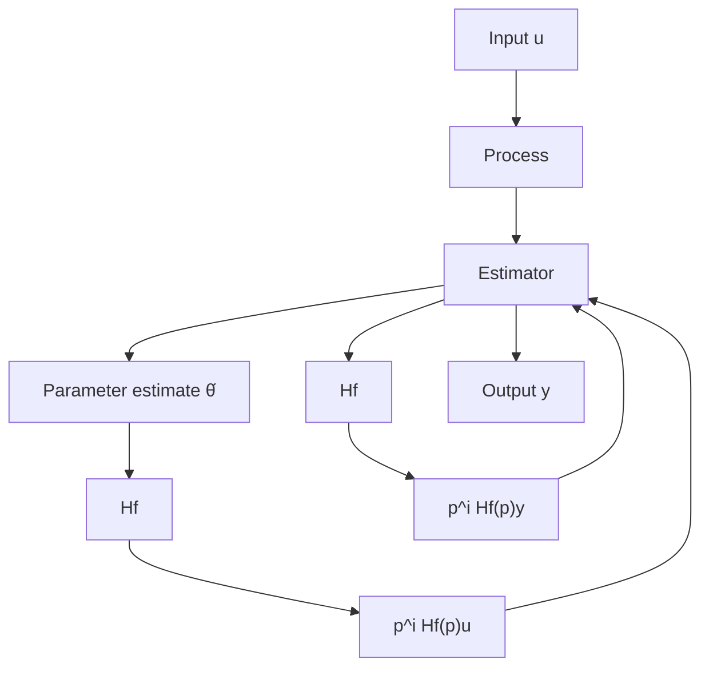

# Continuous-Time Transfer Functions

We now show that the least-squares method can also be used to estimate parameters in continuous-time transfer functions. For instance, consider a continuous-time model of the form

$$\frac {d ^ {n} y}{d t ^ {n}} + a _ {1} \frac {d ^ {n - 1} y}{d t ^ {n - 1}} + \dots + a _ {n} y = b _ {1} \frac {d ^ {m - 1} u}{d t ^ {m - 1}} + \dots + b _ {m} u$$

which can also be written as

$$A (p) y (t) = B (p) u (t) \tag {2.36}$$

where $A(p)$ and $B(p)$ are polynomials in the differential operator $p = d / dt$ . In most cases we cannot conveniently compute $p^n y(t)$ because it would involve taking $n$ derivatives of a signal. The model of Eq. (2.36) is therefore rewritten as

$$A (p) y _ {f} (t) = B (p) u _ {f} (t) \tag {2.37}$$

where

$$y _ {f} (t) = H _ {f} (\boldsymbol {p}) y (t)u _ {f} (t) = H _ {f} (p) u (t)$$

and $H_{f}(p)$ is a stable transfer function with a pole excess of n or more. See Fig. 2.5. If we introduce

$$
\theta = \left( \begin{array}{c c c c c c} a _ {1} & \dots & a _ {n} & b _ {1} & \dots & b _ {m} \end{array} \right) ^ {T}

\varphi^ {T} (t) = \left( \begin{array}{c c c c c c} - p ^ {n - 1} y _ {f} & \dots & - y _ {f} & p ^ {m - 1} u _ {f} & \dots & u _ {f} \end{array} \right)

= \left( \begin{array}{l l l l l} - p ^ {n - 1} H _ {f} (p) y & \dots & - H _ {f} (p) y & p ^ {m - 1} H _ {f} (p) u & \dots & H _ {f} (p) u \end{array} \right)
$$

the model expressed by Eq. (2.37) can be written as

$$p ^ {n} y _ {f} (t) = p ^ {n} H _ {f} (p) y (t) = \varphi^ {T} (t) \theta$$

flowchart

Figure 2.5 Block diagram of estimator with filters $H_{f}$ .

By a proper realization of the filter $H_{f}$ it is possible to use one filter to generate all the signals $p^{i}H_{f}(p)y, i = 0, \ldots, n$ , and another filter to generate $p^{i}H_{f}(p)u, i = 0, \ldots, m - 1$ . Standard least squares can now be applied, since this is a regression model. A recursive estimate is given by Theorem 2.5. With the restriction on $H_{f}$ there will not be any pure differentiation of the output or the input to the system.
