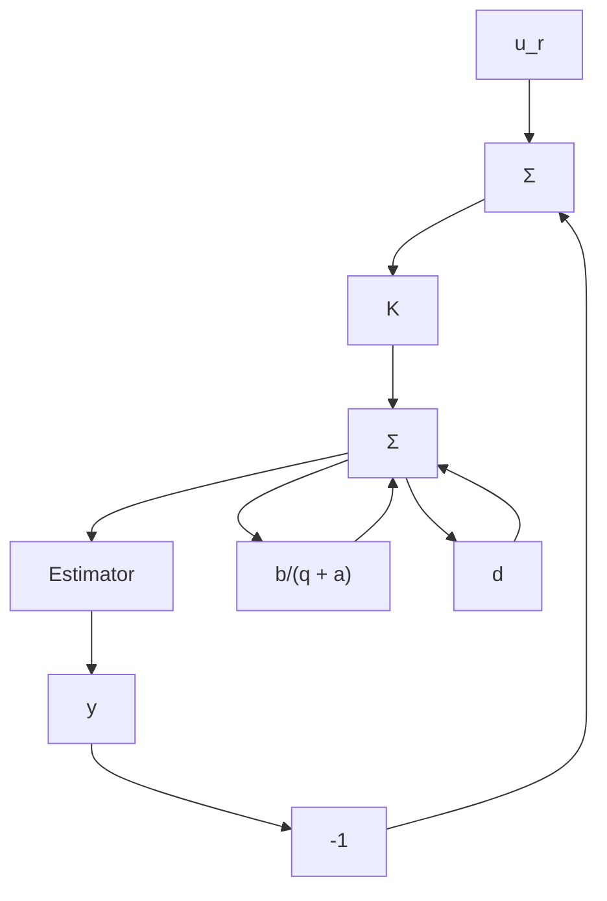

$$
\hat {\theta} (t) = \hat {\theta} (t - 1) + K (t) \left(y (t) - \varphi^ {T} (t) \hat {\theta} (t - 1)\right)K (t) = \Phi_ {v} P (t - 1) \varphi (t - 1) \left(R _ {2} + \varphi^ {T} (t - 1) P (t - 1) \varphi (t - 1)\right) ^ {- 1}
\begin{array}{l} P (t) = \Phi_ {v} P (t - 1) \Phi_ {v} ^ {T} + R _ {1} \\ - \Phi_ {v} P (t - 1) \varphi (t) \left(R _ {2} + \varphi^ {T} (t) P (t - 1) \varphi (t)\right) ^ {- 1} \varphi^ {T} (t) P (t - 1) \Phi_ {v} ^ {T} \\ \end{array}
$$

2.15 Show that Eq. (2.28) minimizes Eq. (2.27), and use this to prove Theorem 2.5. Hint: Use Remark 1 in Theorem 2.5 and that the time derivative of the identity $I = PP^{-1}$ is

$$\frac {d P}{d t} = - P \frac {d (P ^ {- 1})}{d t} P$$

2.16 In an adaptive controller the process parameters are estimated according to the model

$$y (t) + a _ {1} y (t - 1) + a _ {2} y (t - 2) = b _ {0} u (t - 1) + b _ {1} u (t - 2) + e (t)$$

The controller has the structure

$$u (t) + r _ {1} u (t - 1) = - s _ {0} y (t) - s _ {1} y (t - 1)$$

The reference value is thus zero. Consider the case in which the controller parameters are constant.

(a) Show that the parameters $a_{1}$ , $a_{2}$ , $b_{0}$ , and $b_{1}$ cannot be uniquely determined.

(b) Characterize the parameter combinations that can be determined.

(c) Show that with the controller structure

$$u (t) + r _ {1} u (t - 1) + r _ {2} u (t - 2) = - s _ {0} y (t) - s _ {1} y (t - 1) - s _ {2} y (t - 2)$$

all process parameters can be estimated uniquely.

flowchart

Figure 2.15 Closed-loop estimation scheme for Problem 2.17.

2.17 Figure 2.15 shows a closed-loop system for estimation of the unknown constant b in the pulse transfer function $H(q) = b/(q + a)$ . The constant a is known and is such that $|a| > 1$ . This means that the open-loop system is unstable, and to have bounded signals for the estimation, we need to stabilize the system with a controller. This is done with a P controller with gain K such that $|a + Kb| < 1$ . The estimator is a least-squares (LS) estimator that is based on the regression model

$$\tilde {y} (t) = \varphi^ {T} (t - 1) \theta$$

where

$$\bar {y} (t) = y (t) + a y (t - 1)\varphi (t - 1) = u (t - 1)\theta = b$$
