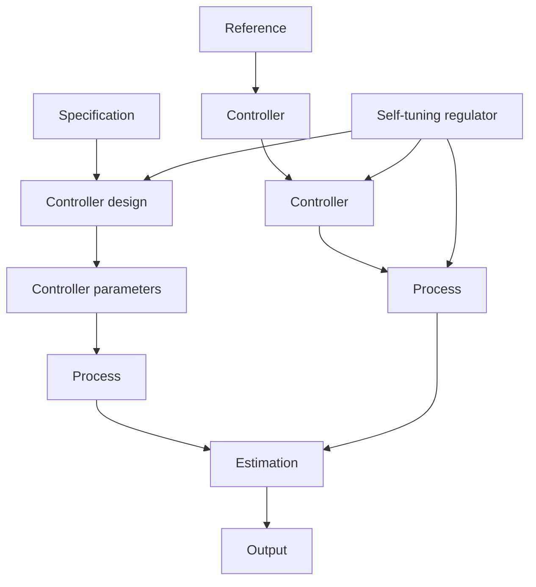

# 3.1 INTRODUCTION

Development of a control system involves many tasks such as modeling, design of a control law, implementation, and validation. The self-tuning regulator (STR) attempts to automate several of these tasks. This is illustrated in Fig. 3.1, which shows a block diagram of a process with a self-tuning regulator. It is assumed that the structure of a process model is specified. Parameters of the model are estimated on-line, and the block labeled "Estimation" in Fig. 3.1 gives an estimate of the process parameters. This block is a recursive estimator of the type discussed in Chapter 2. The block labeled "Controller design" contains computations that are required to perform a design of a controller with a specified method and a few design parameters that can be chosen externally. The design problem is called the underlying design problem for systems with known parameters. The block labeled "Controller" is an implementation of the controller whose parameters are obtained from the control design.

The name “self-tuning regulator” comes from one of the early papers. The main reason for using an adaptive controller is that the process or its environment is changing continuously. It is difficult to analyze such systems. To simplify the problem, it can be assumed that the process has constant but unknown parameters. The term self-tuning was used to express the property that the controller parameters converge to the controller that was designed if the process was known. An interesting result was that this could happen even if the model structure was incorrect.

The tasks shown in the block diagram can be performed in many different ways. There are many possible choices of model and controller structures.

flowchart

Figure 3.1 Block diagram of a self-tuning regulator.
