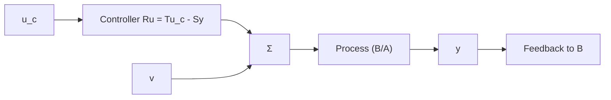

# Process Model

It is assumed that the process is described by the single-input, single-output (SISO) system

$$A (q) y (t) = B (q) (u (t) + v (t))$$

where y is the output, u is the input of the process, and v is a disturbance. The disturbances can enter the system in many ways. Here it has been assumed that they enter at the process input. For linear systems in which the superposition principle holds, an equivalent input disturbance can always be found. Furthermore, A and B are polynomials in the forward shift operator q. The polynomials have the degrees $\deg A = n$ and $\deg B = \deg A - d_{0}$ . Parameter $d_{0}$ , which is called the pole excess, represents the integer part of the ratio of time delay and sampling period. It is sometimes convenient to write the process model in the delay operator $q^{-1}$ . This can be done by introducing the reciprocal polynomial

flowchart

Figure 3.2 A general linear controller with two degrees of freedom.

$$A ^ {*} (q ^ {- 1}) = q ^ {- n} A (q)$$

where $n = \deg A$ . The model can then be written as

$$A ^ {*} (q ^ {- 1}) y (t) = B ^ {*} (q ^ {- 1}) \left(u (t - d _ {0}) + v (t - d _ {0})\right)$$

where

$$A ^ {*} (q ^ {- 1}) = 1 + a _ {1} q ^ {- 1} + \dots + a _ {n} q ^ {- n}B ^ {*} (q ^ {- 1}) = b _ {0} + b _ {1} q ^ {- 1} + \dots + b _ {m} q ^ {- m}$$

with $m = n - d_{0}$ . Notice that since n was defined as the degree of the system, we have $n \geq m + d_{0}$ , and trailing coefficients of $A^{*}$ may thus be zero.

We will mostly deal with discrete time systems. Since the design method is purely algebraic, we can handle continuous systems simultaneously by writing the model

$$A y (t) = B (u (t) + v (t)) \tag {3.1}$$

where A and B denote polynomials in either the differential operator $p = d/dt$ or the forward shift operator q. It is assumed that A and B are relatively prime, that is, that they do not have any common factors. Further, it is assumed that A is monic, that is, that the coefficient of the highest power in A is unity.

A general linear controller can be described by

$$R u (t) = T u _ {c} (t) - S y (t) \tag {3.2}$$
