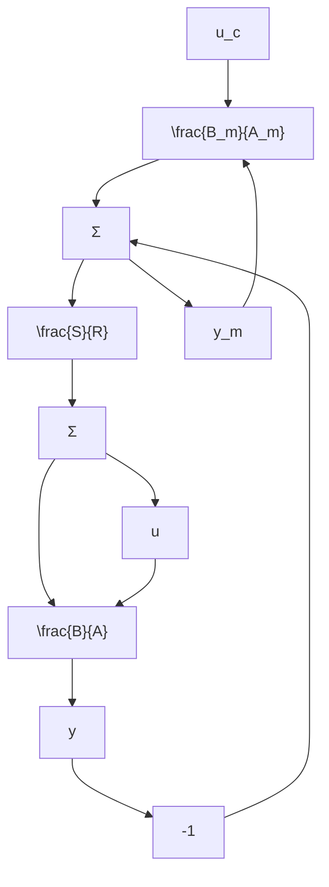

# Relations to Model-Following

Many other design methods can be related to pole placement. We will now show that pole placement can be interpreted as a model-following design. This is of interest because much work on MRAS is formulated in terms of model-following. Model-following generally means that the response of a closed-loop system to command signals is specified by a given model. This means that both poles and zeros of the model are specified by the user. Pole placement, on the other hand, specifies only the closed-loop poles. In the minimum-degree pole placement procedure we did, however, introduce some auxiliary conditions that included the process zeros. We will now show that the control law given by Eq. (3.2) can be interpreted as model-following. It follows from Eqs. (3.11) and (3.12) that

$$\frac {T}{R} = \frac {A _ {o} B _ {m} ^ {\prime}}{R} = \frac {(A R ^ {\prime} + B S) B _ {m} ^ {\prime}}{A _ {m} R} = \frac {A B _ {m}}{B A _ {m}} + \frac {S B _ {m}}{R A _ {m}}$$

The control law of Eq. (3.2) can be written as

$$
\begin{array}{l} u = \frac {T}{R} u _ {c} - \frac {S}{R} y = \frac {A B _ {m}}{B A _ {m}} u _ {c} + \frac {S B _ {m}}{R A _ {m}} u _ {c} - \frac {S}{R} y \\ = \frac {A B _ {m}}{B A _ {m}} u _ {c} - \frac {S}{R} (y - y _ {m}) \\ \end{array}
$$

A block diagram representation of this controller is given in Fig. 3.3. The figure shows that the controller can be interpreted as a combination of a feedforward controller and a feedback controller. The feedforward controller attempts to cancel the plant dynamics and replace it with the response of the model $B_{m}/A_{m}$ . Also the feedback attempts to make the output follow this model. It is thus clear that the control law (3.2) can indeed be interpreted as a model-following algorithm.

flowchart

Figure 3.3 Alternative representation of model-following based on output feedback.
