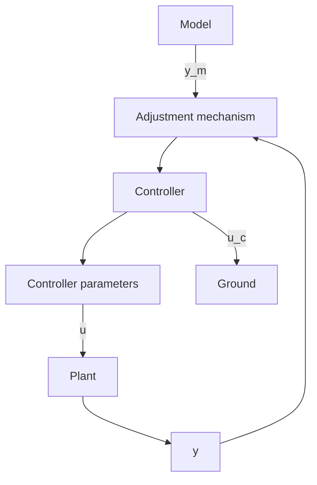

# 5.1 INTRODUCTION

The model-reference adaptive system (MRAS) is an important adaptive controller. It may be regarded as an adaptive servo system in which the desired performance is expressed in terms of a reference model, which gives the desired response to a command signal. This is a convenient way to give specifications for a servo problem. A block diagram of the system is shown in Fig. 5.1. The system has an ordinary feedback loop composed of the process and the controller and another feedback loop that changes the controller parameters. The parameters are changed on the basis of feedback from the error, which is the difference between the output of the system and the output of the reference model. The ordinary feedback loop is called the inner loop, and the parameter adjustment loop is called the outer loop. The mechanism for adjusting the parameters in a model-reference adaptive system can be obtained in two ways: by using a gradient method or by applying stability theory.

flowchart

Figure 5.1 Block diagram of a model-reference adaptive system (MRAS).

In the MRAS the desired behavior of the system is specified by a model, and the parameters of the controller are adjusted based on the error, which is the difference between the outputs of the closed-loop system and the model. Model-reference adaptive systems were originally derived for deterministic continuous-time systems. Extensions to discrete-time systems and systems with stochastic disturbances were given later.
