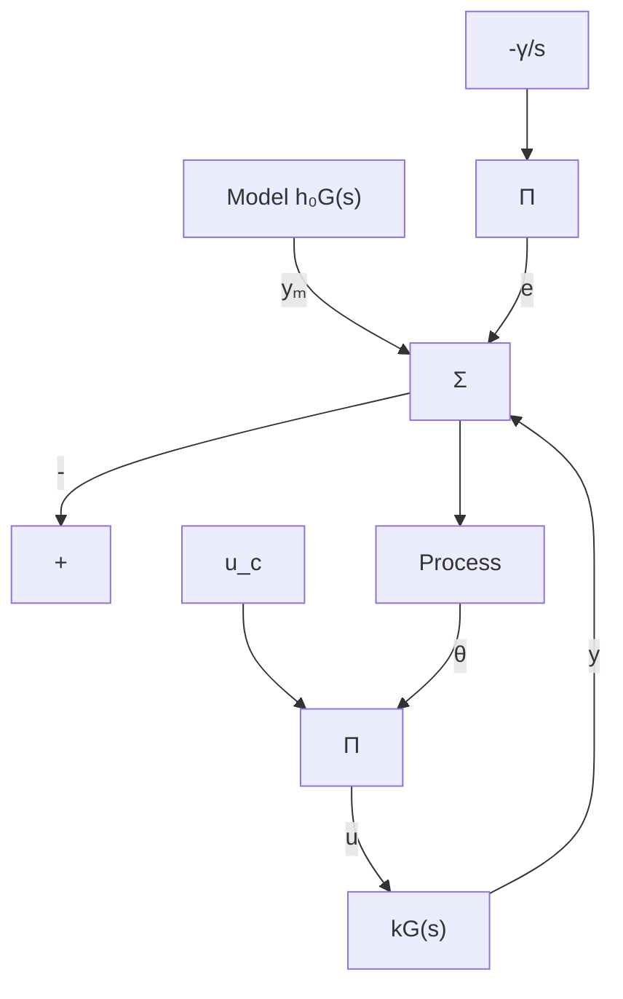

# EXAMPLE 5.1 Adaptation of a feedforward gain

Consider the problem of adjusting a feedforward gain. In this problem it is assumed that the process is linear with the transfer function $kG(s)$ , where $G(s)$ is known and k is an unknown parameter. The underlying design problem is to find a feedforward controller that gives a system with the transfer function $G_{m}(s) = k_{0}G(s)$ , where $k_{0}$ is a given constant. With the feedforward controller

$$u = \theta u _ {c}$$

where u is the control signal and $u_{c}$ the command signal, the transfer function from command signal to the output becomes $\theta k G(s)$ . This transfer function is equal to $G_{m}(s)$ if the parameter $\theta$ is chosen to be

$$\theta = \frac {k _ {0}}{k}$$

flowchart

Figure 5.2 Block diagram of an MRAS for adjustment of a feedforward gain based on the MIT rule.

We will now use the MIT rule to obtain a method for adjusting the parameter $\theta$ when k is not known. The error is

$$e = y - y _ {m} = k G (p) \theta u _ {c} - k _ {0} G (p) u _ {c}$$

where $u_{c}$ is the command signal, $y_{m}$ is the model output, y is the process output, $\theta$ is the adjustable parameter, and p = d/dt is the differential operator. The sensitivity derivative is given by

$$\frac {\partial e}{\partial \theta} = k G (p) u _ {c} = \frac {k}{k _ {0}} y _ {m}$$

The MIT rule then gives the following adaptation law:

$$\frac {d \theta}{d t} = - \gamma^ {\prime} \frac {k}{k _ {0}} y _ {m} e = - \gamma y _ {m} e \tag {5.5}$$

where $\gamma = \gamma'k/k_{0}$ has been introduced instead of $\gamma'$ . Notice that to have the correct sign of $\gamma$ , it is necessary to know the sign of k. Equation (5.5) gives the law for adjusting the parameter. A block diagram of the system is shown in Fig. 5.2.

The properties of the system can be illustrated by simulation. Figure 5.3 shows a simulation when the system has the transfer function

$$G (s) = \frac {1}{s + 1}$$
