```mermaid
graph TD
    A["u_c"] --> B["Σ"]
    B --> C["G_s"]
    C --> D["+"]
    D --> E["Σ"]
    E --> F["G_m(s)"]
    F --> G["-"]
    G --> B
    B --> H["+"]
    H --> I["Σ"]
    I --> J["G_s"]
    J --> K["y"]
    K --> L["+"]
    L --> M["Σ"]
    M --> N["e"]
    N --> O["Σ"]
    O --> P["G_m(s)"]
    P --> Q["+"]
    Q --> R["Σ"]
    R --> S["G_s"]
    S --> T["y"]
    T --> U["+"]
    U --> V["Σ"]
    V --> W["G_m(s)"]
    W --> X["+"]
    X --> Y["Σ"]
    Y --> Z["G_s"]
    Z --> AA["y"]
    AA --> AB["+"]
    AB --> AC["Σ"]
    AC --> AD["G_m(s)"]
    AD --> AE["+"]
    AE --> AF["Σ"]
    AF --> AG["G_s"]
    AG --> AH["y"]
    AH --> AI["+"]
    AI --> AJ["Σ"]
    AJ --> AK["G_m(s)"]
    AK --> AL["+"]
    AL --> AM["Σ"]
    AM --> AN["G_s"]
    AN --> AO["y"]
    AO --> AP["+"]
    AP --> AQ["Σ"]
    AQ --> AR["G_m(s)"]
    AR --> AS["+"]
    AS --> AT["Σ"]
    AT --> AU["G_m(s)"]
    AU --> AV["+"]
    AV --> AW["Σ"]
    AW --> AX["G_m(s)"]
    AX --> AY["+"]
    AY --> AZ["Σ"]
    AZ --> BA["G_m(s)"]
    BA --> BB["y"]
    BB --> BC["+"]
    BC --> BD["Σ"]
    BD --> BE["G_m(s)"]
    BE --> BF["+"]
    BF --> BG["Σ"]
    BG --> BH["G_m(s)"]
    BH --> BI["y"]
    BI --> BJ["+"]
    BJ --> BK["Σ"]
    BK --> BL["G_m(s)"]
    BL --> BM["+"]
    BM --> BN["Σ"]
    BN --> BO["G_m(s)"]
    BO --> BP["y"]
    BP --> BQ["+"]
    BQ --> BR["Σ"]
    BR --> BS["G_m(s)"]
    BS --> BT["y"]
    BT --> BU["+"]
    BU --> BV["Σ"]
    BV --> BW["G_m(s)"]
    BW --> BX["y"]
    BX --> BY["+"]
    BY --> BZ["Σ"]
    BZ --> CA["G_m(s)"]
    CA --> CB["y"]
    CB --> CC["+"]
    CC --> CD["Σ"]
    CD --> CE["G_m(s)"]
    CE --> CF["y"]
    CF --> CG["+"]
    CG --> CH["Σ"]
    CH --> CI["G_m(s)"]
    CI --> CJ["y"]
    CJ --> CK["+"]
    CK --> CL["Σ"]
    CL --> CM["G_m(s)"]
    CM --> CN["y"]
    CN --> CO["+"]
    CO --> CP["Σ"]
    CP --> CQ["G_m(s)"]
    CQ --> CR["y"]
    CR --> CS["+"]
    CS --> CT["Σ"]
    CT --> CU["G_m(s)"]
    CU --> CV["y"]
    CV --> CW["+"]
    CW --> CX["Σ"]
```

Figure 5.4 Block diagram of a model-reference controller for a first-order process.

$$p + a + b \theta_ {2} \approx p + a _ {m}$$

which will be reasonable when parameters are close to their correct values. With this approximation we get the following equations for updating the controller parameters:

$$\frac {d \theta_ {1}}{d t} = - \gamma \left(\frac {a _ {m}}{p + a _ {m}} u _ {c}\right) e \tag {5.9}\frac {d \theta_ {2}}{d t} = \gamma \left(\frac {a _ {m}}{p + a _ {m}} y\right) e$$

In these equations we have combined parameters b and $a_{m}$ with the adaptation gain $\gamma'$ , since they appear as the product $\gamma'b/a_{m}$ . The sign of parameter b must be known to have the correct sign of $\gamma$ . Notice that the filter has also been normalized so that its steady-state gain is unity.
