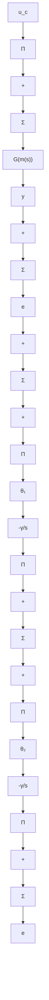

flowchart

Figure 5.11 Block diagram of an MRAS based on Lyapunov theory for a first-order system. Compare with the controller based on the MIT rule for the same system in Fig. 5.4.

Since $u_{c}$ , e, and y are bounded, it follows that $\dot{V}$ is bounded; hence dV/dt is uniformly continuous. From Theorem 5.4 it now follows that the error e will go to zero. However, the parameters will not necessarily converge to their correct values; it is shown only that they are bounded. To have parameter convergence, it is necessary to impose conditions on the excitation of the system. (Compare with Example 5.3.)

The adaptation rule given by Eqs. (5.27) is similar to the MIT rule given by Eqs. (5.9), but the sensitivity derivatives are replaced by other signals. A block diagram of the system is shown in Fig. 5.11. Compare with the corresponding block diagram for the system with the MIT rule in Fig. 5.4. The only difference is that there is no filtering of the signals $u_c$ and $y$ with the Lyapunov rule. In both cases the adjustment law can be written as

$$\frac {d \theta}{d t} = \gamma \varphi e \tag {5.28}$$

where $\theta$ is a vector of parameters and

$$
\varphi = \left( \begin{array}{c c} - u _ {c} & y \end{array} \right) ^ {T}
$$

for the Lyapunov rule and

$$
\varphi = \frac {a _ {m}}{p + a _ {m}} \left( \begin{array}{l l} - u _ {c} & y \end{array} \right) ^ {T}
$$

line

| Time | y |
| --- | --- |
| 0 | 0.5 |
| 5 | 1.0 |
| 10 | 0.5 |
| 15 | -1.0 |
| 20 | -1.0 |
| 25 | 1.0 |
| 30 | 1.0 |
| 35 | -1.0 |
| 40 | -1.0 |
| 45 | 1.0 |
| 50 | 1.0 |
| 55 | -1.0 |
| 60 | -1.0 |
| 65 | 1.0 |
| 70 | 1.0 |
| 75 | -1.0 |
| 80 | -1.0 |
| 85 | 1.0 |
| 90 | 1.0 |
| 95 | -1.0 |
| 100 | -1.0 |

line

