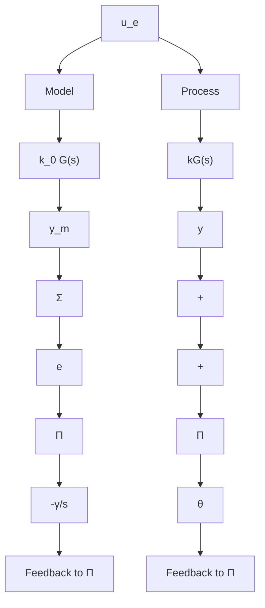
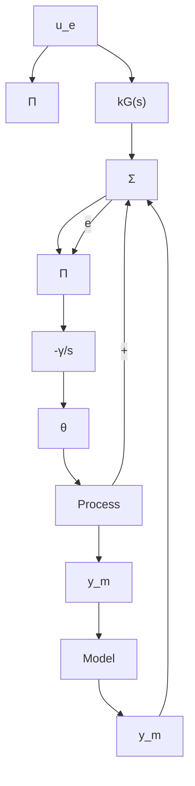

# Summary

In this section we have shown that it is possible to construct parameter adjustment rules based on Lyapunov's stability theory. The adjustment rules obtained in this way guarantee that the error goes to zero, but it cannot be asserted that the parameters converge to their correct values. The adjustment rules obtained are similar to those obtained by the MIT rule. However, the rules are not normalized. The adjustment rules have the remarkable property that arbitrarily high adaptation gains can be used. This property depends on the strong assumptions that are made. This is discussed further in Chapter 6.

flowchart

flowchart

Figure 5.14 Block diagrams of the adaptive systems for feedforward gain compensation obtained by (a) the MIT rule and (b) the Lyapunov rule.
