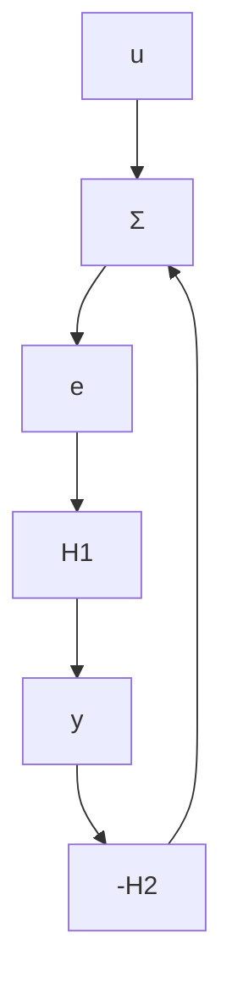

# THEOREM 5.6 The small gain theorem

Consider the system in Fig. 5.16. Let $\gamma_{1}$ and $\gamma_{2}$ be the gains of the systems $H_{1}$ and $H_{2}$ . The closed-loop system is BIBO stable if

$$\gamma_ {1} \gamma_ {2} < 1 \tag {5.42}$$

and its gain is less than

$$\gamma = \frac {\gamma_ {1}}{1 - \gamma_ {1} \gamma_ {2}} \tag {5.43}$$

Outline of proof: For a rigorous proof it must first be established that y exists. If this is true, we have

$$y = H _ {1} e = H _ {1} (u - H _ {2} y)$$

Hence

$$\| y \| \leq \| H _ {1} u \| + \| H _ {1} H _ {2} y \| \leq \gamma_ {1} \| u \| + \gamma_ {1} \gamma_ {2} \| y \|$$

Because of Eq. (5.42) we can solve for $\|y\|$ . Hence

$$\| y \| \leq \frac {\gamma_ {1}}{1 - \gamma_ {1} \gamma_ {2}} \| u \| = \gamma \| u \|$$

which proves BIBO stability and gives the expression (5.43) for the gain of the system.

Remark 1. The result has a strong intuitive interpretation. It simply says that if the total gain around the loop is less than 1, then the closed-loop system is stable.

Remark 2. For the special case of linear systems with $L_{2}$ norms it follows from Example 5.8 that the gain is the maximum magnitude of the transfer function.

flowchart

Figure 5.16 Block diagram of a simple feedback loop.

The theorem can be interpreted as an extension of the Nyquist theorem. The condition (5.42) implies that the loop gain is always less than 1. From this interpretation we can also conclude that the result is quite conservative.
