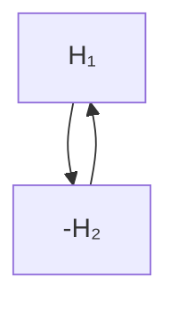
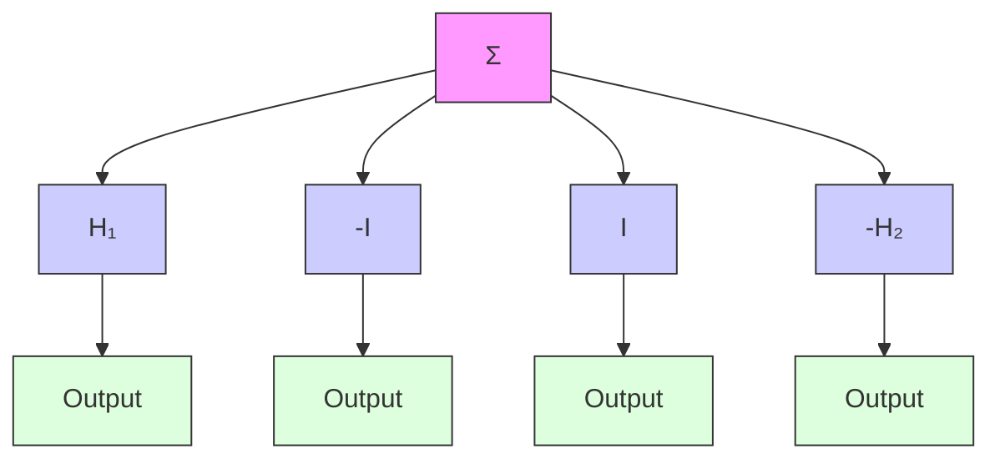
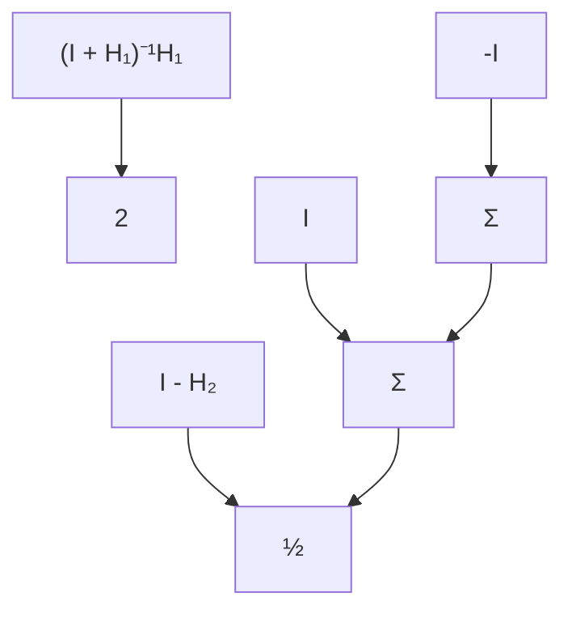
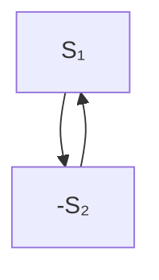

# Relations between Passivity and Small Gain Theorems

The small gain theorem (Theorem 5.6) and the passivity theorem (Theorem 5.8) are closely related. To investigate this connection further, we consider signal spaces that are inner product spaces and we show that the small gain theorem can be derived from the passivity theorem. We start with Fig. 5.16 and make a sequence of transformations of the feedback loop that are shown in Fig. 5.17.

Consider the closed-loop system in Fig. 5.17(a). Assume that the system $H_{1}$ is strictly output passive and that $H_{2}$ is passive. In Fig. 5.17(b) we have introduced two loops that cancel each other. The input-output relations of the encircled loops are $(I + H_{1})^{-1}H_{1}$ and $I - H_{2}$ , respectively. These two systems are shown in Fig. 5.17(c), where we have also added two loops and two gains (1/2 and 2) that cancel each other. The transfer functions of the encircled loops

a)   

flowchart

b)   

flowchart

c)   

flowchart

d)

flowchart

Figure 5.17 Four equivalent systems.

are

$$S _ {1} = 2 \left(H _ {1} + I\right) ^ {- 1} H _ {1} - \left(I + H _ {1}\right) ^ {- 1} \left(I + H _ {1}\right) = \left(H _ {1} + I\right) ^ {- 1} \left(H _ {1} - I\right)$$

and
