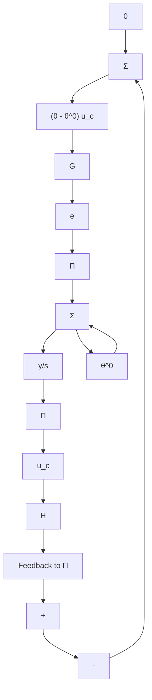

# 5.7 APPLICATIONS TO ADAPTIVE CONTROL

The results from input-output stability theory are now used to construct adjustment rules for adaptive systems. So that we can focus on the principles and avoid unnecessary details, only the problem of adjusting a feedforward gain is considered in this section.

Consider a system with transfer function $kG(s)$ where $G(s)$ is known and k is an unknown constant. We will determine an adaptive feedforward compensation so that the transfer function from command signal to output is $k_{0}G(s)$ . This problem was previously considered in Examples 5.1 and 5.3. A parameter adjustment law was also derived for the problem in Section 5.5 using Lyapunov theory. This control law can be represented by the block diagram in Fig. 5.14(b). According to Theorem 5.5 the adaptive system will be stable if the transfer function $G(s)$ is SPR. This condition indicates that the result is related to passivity theory. To establish this, we redraw the block diagram as in Fig. 5.18, which gives a configuration in which the passivity theorem can be applied. To use the passivity theorem, we must investigate the properties of the dashed block in Fig. 5.18. We have the following lemma.

flowchart

Figure 5.18 Representation of the system with adjustable feedforward gain when using the control law of Eq. 5.40. Compare with Fig. 5.14(b).
