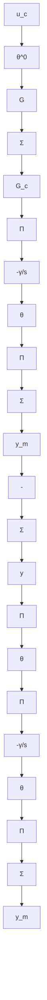

# Design of Stable Adjustment Mechanisms

The passivity theorem gives a convenient way to construct stable adjustment laws. We simply try to introduce some compensating network so that the transfer function relating the error to $(\theta - \theta^{0})u_{c}$ is strictly positive real, as is illustrated in Fig. 5.19. For systems with output feedback, the problem is to find a compensator $G_{c}$ such that the transfer function $GG_{c}$ is strictly positive real. This can be done by using the Kalman-Yakubovich lemma (Lemma 5.2). With pure feedforward control it is natural to assume that $G$ is stable. It can then be written as

flowchart

Figure 5.19 A stable parameter adjustment law is obtained if $GG_{c}$ is SPR.

$$G (s) = \frac {B (s)}{A (s)}$$

where $A(s)$ has all its zeros in the left half-plane. For a stable polynomial $A(s)$ a polynomial $C(s)$ such that $C(s)/A(s)$ is SPR can always be found. To do this, we introduce the following canonical realization of $1/A(s)$ :

$$
\frac {d x}{d t} = \left( \begin{array}{c c c c c} - a _ {1} & - a _ {2} & \dots & - a _ {n - 1} & - a _ {n} \\ 1 & 0 & & 0 & 0 \\ \vdots & & & & \\ 0 & 0 & & 1 & 0 \end{array} \right) x + \left( \begin{array}{c} 1 \\ 0 \\ \vdots \\ 0 \end{array} \right) u
$$

Choose a symmetric positive definite matrix Q and solve the equation

$$\boldsymbol {A} ^ {T} \boldsymbol {P} + \boldsymbol {P A} = - \boldsymbol {Q}$$

The coefficients of a C polynomial such that $C(s)/A(s)$ is SPR are then the first row of the P matrix.

The polynomial $C(s)$ will have a degree that is at most equal to $\deg A - 1$ . For systems with stable zeros and pole excess 1 it is thus possible to find a stable adjustment rule by choosing $G_{c}(s) = C(s)/B(s)$ . However, for systems with higher pole excess than 1 the compensator required to make $GG_{c}$ strictly positive real will contain derivatives. We will show how to deal with the case in which the pole excess is higher by introducing the augmented error.
