# Summary

The problem of adjusting the gain in a known system has been used to introduce some ideas in the design of stable model-reference adaptive systems. It was first shown that adjustment rules could be obtained for systems in which the plant is strictly positive real. The parameter adjustment rules were similar to those obtained by the gradient method.

```mermaid
graph TD
    A["u_c"] --> B["Model k₀G"]
    B --> C["y_m"]
    C --> D["Process kG"]
    D --> E["y"]
    E --> F["Σ"]
    F --> G["e"]
    G --> H["Σ"]
    H --> I["ε"]
    I --> J["Π"]
    J --> K["-γ/s"]
    K --> L["θ"]
    L --> M["Σ"]
    M --> N["η"]
    N --> O["+"]
    O --> P["Π"]
    P --> Q["Process Π"]
    Q --> R["Process Π̅"]
    R --> S["G₁"]
    S --> T["+"]
    T --> U["Π̅"]
    U --> V["G₂"]
    V --> W["ū_c"]
    W --> X["+"]
    X --> Y["Process Π̅"]
    Y --> Z["G₁"]
    Z --> AA["+"]
    AA --> AB["Π̅"]
    AB --> AC["Process Π"]
    AC --> AD["G₂"]
    AD --> AE["ū_c"]
    AE --> AF["+"]
    AF --> AG["Process Π̅"]
```

flowchart

Figure 5.20 Block diagram of a model-reference adaptive system based on the augmented error.

The class of systems could then be extended by using adjustment rules in which the error is filtered. In this way the problem can be solved for stable minimum-phase systems that have pole excess less than 1. The idea of augmented error was introduced to solve the problem of higher pole excess.
