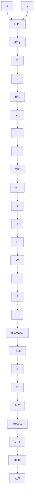

# Design Parameters

Several parameters must be chosen in the design procedure:

- The model transfer function $B_{m} / A_{m}$ ,   
• The observer polynomial $A_{0}$ ,   
• The degrees of polynomials R, S, and T, and   
• The polynomials $P_{1}$ , $P_{2}$ , and Q.

Many different model-reference adaptive systems can be obtained by different choices of the design parameters. A popular choice of the polynomials is $P_{1} = A_{m}, P_{2} = A_{o}$ , and $Q = A_{o}A_{m}$ .

flowchart

Figure 5.21 Block diagram of a model-reference adaptive system for a SISO system.
