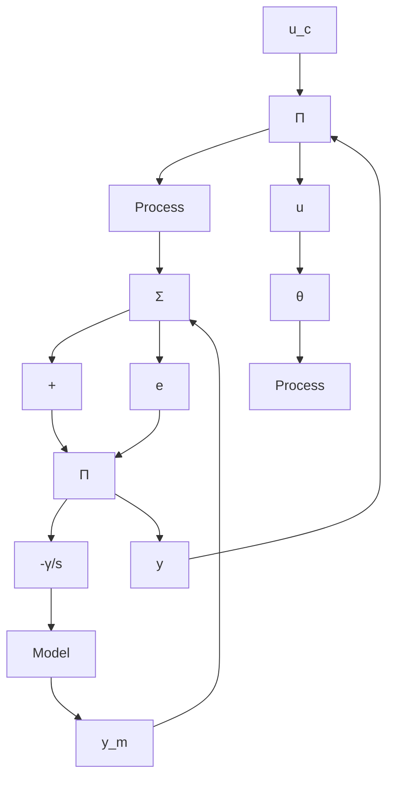

6.8 Consider the system

$$y (t) = u (t - 1) + a$$

where $a$ is an unknown constant. Construct an adaptive control law that makes $y$ follow a command $u_{c}$ asymptotically. Prove that it converges.

6.9 Consider the continuous-time model

$$y (t) = \varphi^ {T} (t) \theta$$

Let the parameter $\theta$ be estimated by

$$\frac {d \hat {\theta}}{d t} = \gamma \frac {\varphi (t)}{\alpha + \varphi^ {T} (t) \varphi (t)} e (t)$$

where $\gamma > 0$ and $\alpha > 0$ are real constants and

$$e (t) = y (t) - \varphi^ {T} (t) \hat {\theta} (t)$$

Assume that $y(t)$ is given by

$$y (t) = \varphi^ {T} (t) \theta_ {0}$$

Prove that

$$| \hat {\theta} (t) - \theta_ {0} | \leq | \hat {\theta} (s) - \theta_ {0} | \leq | \hat {\theta} (0) - \theta_ {0} | \quad t > s > 0$$

and that

$$\frac {| e (t) |}{\sqrt {\alpha + \varphi^ {T} (t) \varphi (t)}} \rightarrow 0$$

as $t \to \infty$ .

6.10 Consider the system in Example 6.12. Interpret the results as if the adaptive algorithm tried to estimate parameters $a$ and $b$ in the transfer function $G(s) = b / (s + a)$ . Use Eqs. (6.70) to show that

$$\hat {a} = \frac {2 2 9 - 3 1 \omega^ {2}}{2 5 9 - \omega^ {2}}\hat {b} = \frac {4 5 8}{2 5 9 - \omega^ {2}}$$

Determine the parameters for $\omega = 2.72$ and $\omega = 17.03$ . Explain the results by evaluating $G(s)$ for the corresponding frequencies.

flowchart

Figure 6.22 Adaptive feedforward controller in Problem 6.11.

6.11 A feedforward gain is adapted as shown in the block diagram in Fig. 6.22. The model is given by

$$\frac {d y _ {m}}{d t} = - y _ {m} + u _ {c}$$

The process is not linear, however, but is given by

$$\frac {d y}{d t} = - y - a y ^ {3} + u$$

Let $\gamma = 1$ and $u_{c} = 1$ .

(a) What are the equilibrium points of the system?   
(b) Linearize the system around the equilibrium points, and determine how the stability of the linearized system depends on the parameter $a$ .   
(c) Simulate the behavior of the nonlinear adaptive system to verify the results in part (b).

6.12 An integrator process

$$G (s) = \frac {1}{s}$$

is to be controlled by the error feedback law

$$s U (s) = (4 s + \theta) (U _ {c} (s) - Y (s))$$
