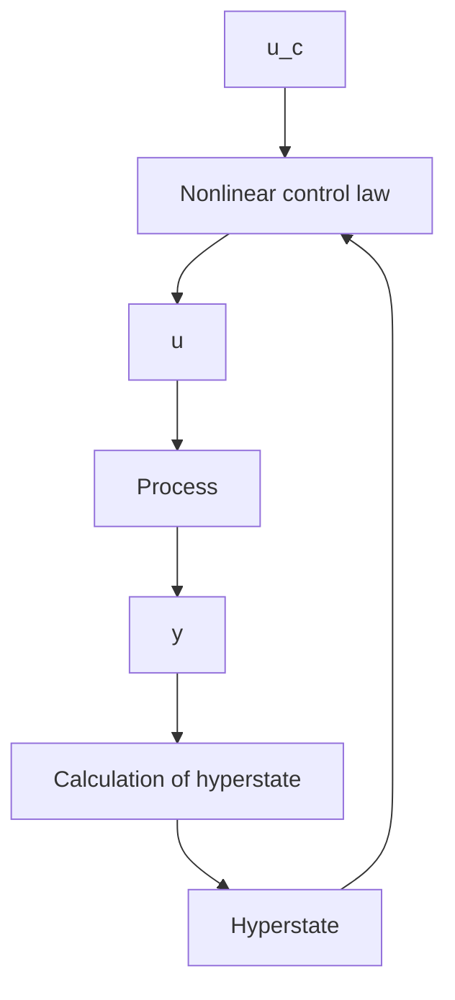

Figure 7.1 Block diagram of an adaptive regulator obtained from stochastic control theory.

The structural simplicity of the solution is obtained at the price of introducing the hyperstate, which can be a quantity of very high dimension. Notice that the structure is similar to that of the self-tuning regulator. The self-tuning regulator can be regarded as an approximation; the conditional probability distribution is replaced by a distribution with all mass at the conditional mean value. In Fig. 7.1 there is no distinction between the parameters and the other state variables of the process. The regulator can therefore handle very rapid parameter variations. Furthermore, the averaging methods based on separation of the states of the process and the parameters (used in Chapter 6) cannot be used to analyze the system. The optimal control law has an interesting property. The control attempts to drive the output to the desired value, but it will also introduce perturbations when the estimates are uncertain. This will improve the estimates and the future control. The optimal controller achieves a correct balance between maintaining good control and small estimation errors. This is called dual control.

The chapter is organized in the following way. The idea with multistep decision problems is introduced in Section 7.2, where the two-armed bandit problem is introduced. A general stochastic adaptive control problem is formulated in Section 7.3, and Section 7.4 gives the derivation of the Bellman equation. The consequences of the structure of the solution are discussed, and the dual property is analyzed. Different ways to approximate the dual controller are discussed in Section 7.5. However, only very simple examples of dual controllers can be solved numerically, but the solutions give some useful indications of how suboptimal controllers can be constructed. Some examples are given in Section 7.6, and the stochastic adaptive approach is summarized in Section 7.7.
