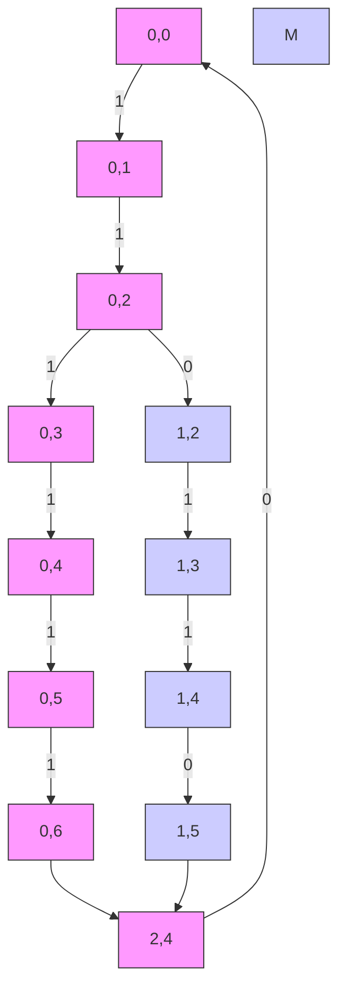

```mermaid
graph TD
    A["0,0"] -->|1| B["0,1"]
    B -->|1| C["0,2"]
    C -->|1| D["0,3"]
    D -->|1| E["0,4"]
    E -->|1| F["0,5"]
    F -->|1| G["0,6"]
    G --> H["2,4"]
    H -->|0| A
    C -->|0| I["1,2"]
    I -->|1| J["1,3"]
    J -->|1| K["1,4"]
    K -->|0| L["1,5"]
    L --> H
    style A fill:#f9f,stroke:#333
    style B fill:#f9f,stroke:#333
    style C fill:#f9f,stroke:#333
    style D fill:#f9f,stroke:#333
    style E fill:#f9f,stroke:#333
    style F fill:#f9f,stroke:#333
    style G fill:#f9f,stroke:#333
    style H fill:#f9f,stroke:#333
    style I fill:#ccf,stroke:#333
    style J fill:#ccf,stroke:#333
    style K fill:#ccf,stroke:#333
    style L fill:#ccf,stroke:#333
    style M fill:#ccf,stroke:#333
```

Figure 7.2 The optimal strategy for the two-armed bandit problem in Example 7.1 when N = 6.
