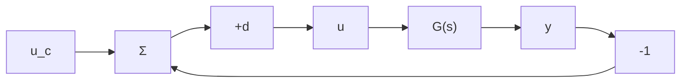

# The Key Idea

The basic idea is the observation that many processes have limit cycle oscillations under relay feedback. A block diagram of such a system is shown in Fig. 8.3. The input and output signals obtained when the command signal $u_{c}$ is zero are shown in Fig. 8.4. The figure shows that a limit cycle oscillation is established quite rapidly. We can intuitively understand what happens in the following way: The input to the process is a square wave with frequency $\omega_{u}$ . By a Fourier series expansion we can represent the input by a sum of sinusoids with frequencies $\omega_{u}, 3\omega_{u}$ , and so on. The output is approximately sinusoidal, which means that the process attenuates the higher harmonics effectively. Let the amplitude of the square wave be $d$ ; then the fundamental component has the amplitude $4d / \pi$ . Making the approximation that all higher harmonics can be neglected, we find that the process output is a sinusoid with frequency $\omega_{u}$ and amplitude

flowchart

Figure 8.3 Linear system with relay control.

line

| Time | Value |
| --- | --- |
| 0 | 1 |
| 1 | 0 |
| 2 | -1 |
| 3 | 0 |
| 4 | 1 |
| 5 | 0 |
| 6 | -1 |
| 7 | 0 |
| 8 | 1 |
| 9 | 0 |
| 10 | -1 |
| 11 | 0 |
| 12 | 1 |

Figure 8.4 Input and output of a system with relay feedback.

$$a = \frac {4 d}{\pi} | G (i \omega_ {u}) |$$

To have an oscillation, the output must also go through zero when the relay switches. Moreover, the fundamental component of the input and the output must have opposite phase. We can thus conclude that the frequency $\omega_{u}$ must be such that the process has a phase lag of $180^{\circ}$ . The conditions for oscillation are thus

$$\arg G (i \omega_ {u}) = - \pi \quad \text { and } \quad | G (i \omega_ {u}) | = \frac {a \pi}{4 d} = \frac {1}{K _ {u}} \tag {8.8}$$
