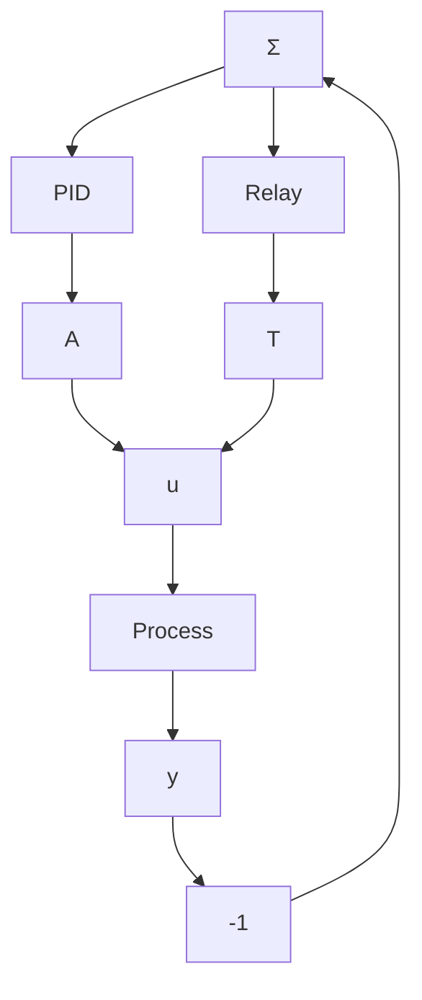

# The Method of Describing Function

The approximative method used to derive the conditions for relay oscillations given by Eqs. (8.8) is called the method of harmonic balance. We will now describe a slight variation of the method that can be used to obtain additional insight. This is called the describing function method. It can be described as follows: Consider a simple feedback system composed of a linear part with the transfer function $G(s)$ and feedback with an ideal relay as shown in Fig. 8.3. The conditions for limit cycle oscillations can be determined approximately by investigating the propagation of sinusoidal signals around the loop. There will be higher harmonics because of the relay, but they will be neglected. The propagation of a sine wave through the linear system is described by the complex number $G(i\omega)$ . Similarly, the propagation of a sine wave through the nonlinearity can also be characterized by a complex number $N(a)$ , which depends on the amplitude of the signal at the input of the nonlinearity. $N(a)$ is called the describing function of the nonlinearity. The condition for oscillation is then that the signal comes back with the same amplitude and phase as it passes the closed loop. This gives the condition

flowchart

Figure 8.5 Block diagram of a relay auto-tuner.

text_image

-1/N(a)
G(iω)

Figure 8.6 Nyquist curve $G(i\omega)$ and the describing function $N(a)$ for a relay.

$$G (i \omega) N (a) = - 1$$

This condition can be represented graphically by also plotting the curve $N(a)$ in the Nyquist diagram. (See Fig. 8.6.) For the relay the nonlinearity is

$$N (a) = \frac {4 d}{a \pi}$$

because a is the input signal amplitude and the fundamental component of the output has amplitude $4d/\pi$ . A possible oscillation is at the intersection of the curves. The frequency is read from the Nyquist curve and the amplitude from the describing function.
