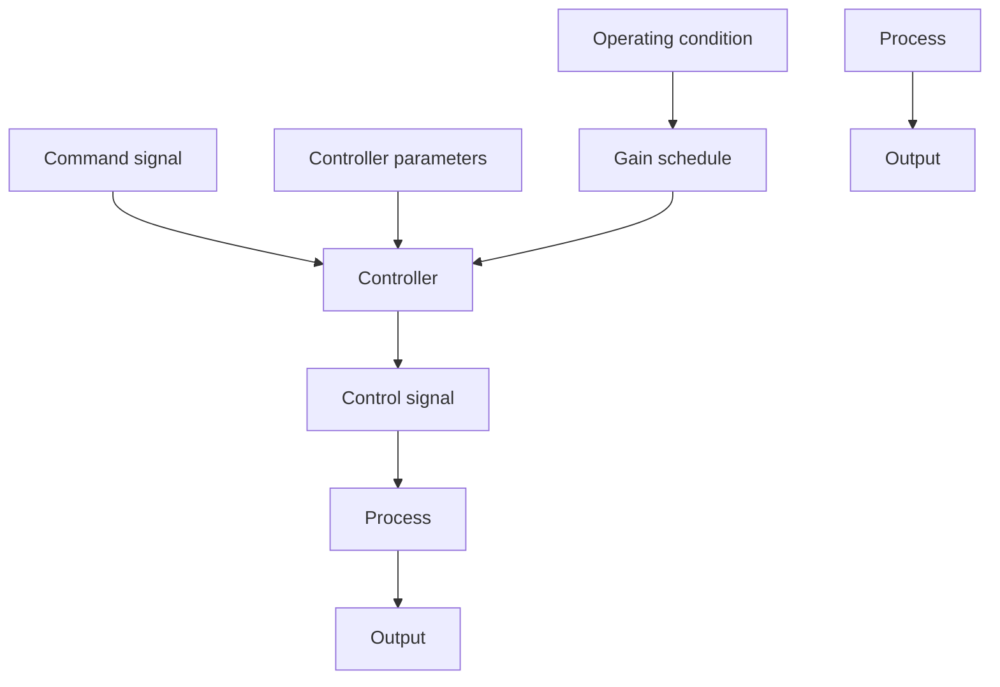

# 9.2 THE PRINCIPLE

It is sometimes possible to find auxiliary variables that correlate well with the changes in process dynamics. It is then possible to reduce the effects of parameter variations simply by changing the parameters of the controller as functions of the auxiliary variables (see Fig. 9.1). Gain scheduling can thus be viewed as a feedback control system in which the feedback gains are adjusted by using feedforward compensation. The concept of gain scheduling originated in connection with the development of flight control systems. In this application the Mach number and the dynamic pressure are measured by air data sensors and used as scheduling variables.

A main problem in the design of systems with gain scheduling is to find suitable scheduling variables. This is normally done on the basis of knowledge of the physics of a system. In process control the production rate can often be chosen as a scheduling variable, since time constants and time delays are often inversely proportional to production rate. (Compare Example 1.5.)

flowchart

Figure 9.1 Block diagram of a system in which influences of parameter variations are reduced by gain scheduling.

When scheduling variables have been determined, the controller parameters are calculated at a number of operating conditions by using some suitable design method. The controller is thus tuned or calibrated for each operating condition. The stability and performance of the system are typically evaluated by simulation; particular attention is given to the transition between different operating conditions. The number of entries in the scheduling tables is increased if necessary. Notice, however, that there is no feedback from the performance of the closed-loop system to the controller parameters.
