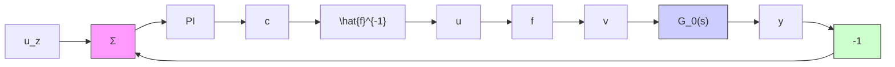

# 9.3 DESIGN OF GAIN-SCHEDULING CONTROLLERS

It is difficult to give general rules for designing gain-scheduling controllers. The key question is to determine the variables that can be used as scheduling variables. It is clear that these auxiliary signals must reflect the operating conditions of the plant. Ideally, there should be simple expressions for how the controller parameters relate to the scheduling variables. It is thus necessary to have good insight into the dynamics of the process if gain scheduling is to be used. The following general ideas can be useful:

• Linearization of nonlinear actuators,   
- Gain scheduling based on measurements of auxiliary variables,   
• Time scaling based on production rate, and   
• Nonlinear transformations.

The ideas are illustrated by some examples.

flowchart

Figure 9.2 Compensation of a nonlinear actuator using an approximate inverse.
