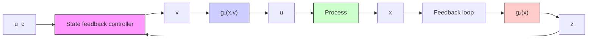

flowchart

Figure 9.7 Block diagram of a controller based on nonlinear transformation.

A simple version of the problem also occurs in control of industrial robots. In this case the basic equation can be written as

$$J \frac {d ^ {2} \varphi}{d t ^ {2}} = T _ {e}$$

where J is the moment of inertia, $\varphi$ is an angle at a joint, and $T_{e}$ is a torque, which depends on the motor current, the torque angles, and their first two derivatives. The equations are thus in the desired form, and the nonlinear feedback is obtained by determining the currents that give the desired torque. The problem is therefore called the torque transformation.
