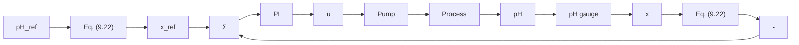

To make sure that the closed-loop system is stable for small perturbations around an equilibrium of pH = 7, the gain should thus be less than 0.009. A reasonable value of the gain for operation at pH = 8 is k = 0.01, but this gain will give an unstable system at pH = 7 and is too low for a reasonable response at pH = 9. Figure 9.10 shows PI control with gain 0.01 and reset time 1. The process is started at equilibrium pH = 4. The reference value is then changed to 7, 8, and 9.

line

| Time | Output pH (a) | Output pH (b) | Output pH (c) | Input u (a) | Input u (b) | Input u (c) | Concentration x (a) | Concentration x (b) | Concentration x (c) |
| --- | --- | --- | --- | --- | --- | --- | --- | --- | --- |
| 0 | 4 | 4 | 4 | 0.9 | 0.9 | 0.9 | -1e-4 | -1e-4 | -1e-4 |
| 2 | 8 | 8 | 8 | 1.0 | 1.0 | 1.0 | -5e-5 | -5e-5 | -5e-5 |
| 4 | 8 | 8 | 8 | 1.0 | 1.0 | 1.0 | 0 | 0 | 0 |
| 6 | 8 | 8 | 8 | 1.0 | 1.0 | 1.0 | 0 | 0 | 0 |
| 8 | 8 | 8 | 8 | 1.0 | 1.0 | 1.0 | 0 | 0 | 0 |
| 10 | 8 | 8 | 8 | 1.0 | 1.0 | 1.0 | 0 | 0 | 0 |

Figure 9.10 Output pH and control signal when the process in Example 9.8 is controlled by using a PI controller when $pH_{ref}$ is (a) 7; (b) 8; (c) 9.

The calculations and the simulation illustrate the key problems with pH control. The difficulties are compounded by the presence of time delays and flow variations. One way to get around the problem is to use the concentration x as the output rather than pH. Figure 9.11 shows a possible control scheme in which the measured pH and the reference value of pH are transformed into equivalent concentrations. This means that the variable x is computed for the

flowchart

Figure 9.11 Control configuration for the pH control problem in Example 9.8.

line

