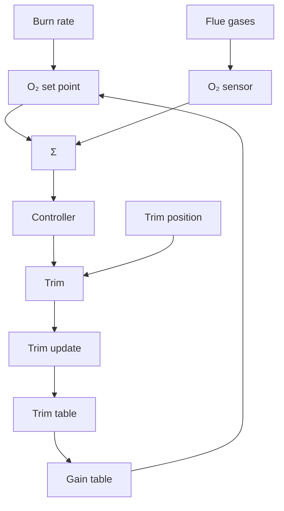

# Combustion Control

In combustion control of a boiler it is important to adjust the oxygen content of the flue gases. The flow of combustion air depends on the burn rate in the boiler. The measurement signal is the oxygen content in the exhaust stack, and the control signal is the trim position, which controls the flow of combustion air. There is a significant time delay between the input to the burner and the oxygen sensor in the exhaust stack. With a conventional controller there is then a loss of efficiency before the correct trim position is reached after a change in the burn rate. One configuration based on adaptive feedforward and gain scheduling is shown in Fig. 9.13. The working range of the boiler is divided into regions. For each region there is a memory (digital integrator). All integrators are zero initially. When the boiler starts to operate, the trim control will adjust the oxygen setpoint. When the setpoint level is achieved, the appropriate integrator is set to the correct trim position. A trim profile will be built up as the boiler works over its range. When the boiler returns to a position at which the integrator is set, the stored trim value is instantly fed to the trim drive actuator, thus eliminating the lag from the control loop. If the fuel changes, the trim profile is updated automatically. The controller thus works with an adaptive feedforward compensation from the burn rate. There is also a gain scheduling of the loop gain of the controller to get tight control under all firing conditions. This gain schedule is built up in commissioning the controller.

flowchart

Figure 9.13 Adaptive feedforward and gain scheduling in an oxygen trim controller.
