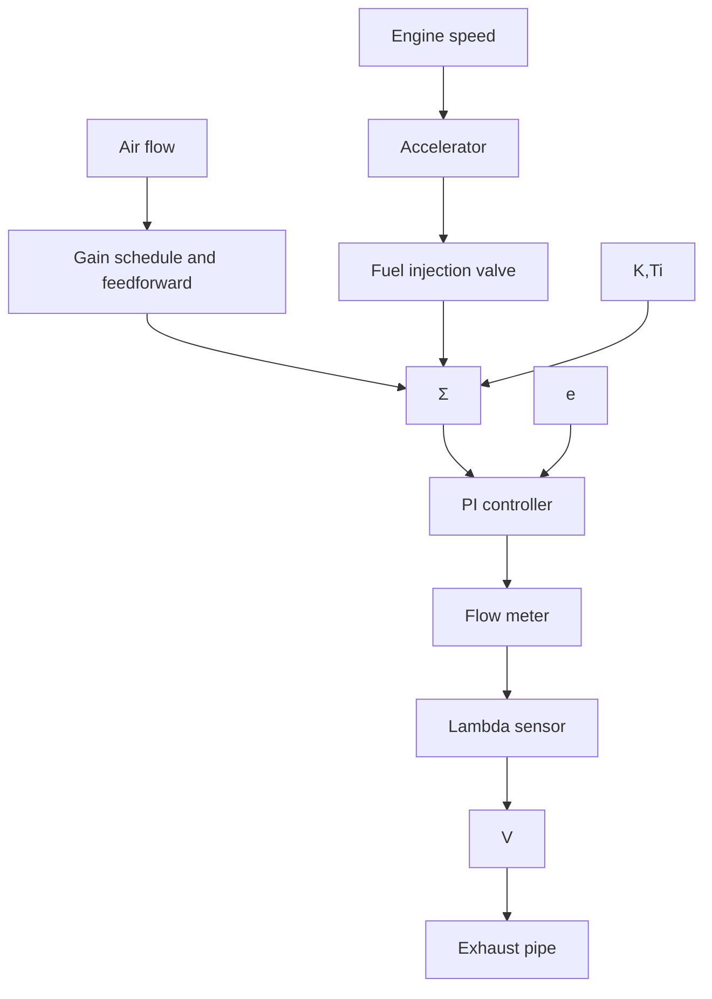

# Fuel-Air Control in a Car Engine

A schematic drawing of a microcomputer control system for a car engine is shown in Fig. 9.14. The accelerator is connected to the throttle valve. The fuel injection is governed by a table lookup controller. The control variable, which is the opening time for the fuel injection valve, is controlled by a combination of feedforward and feedback. The feedforward signal is a nonlinear function of engine speed and load. The load is represented by the air flow, which can be measured by using a hot wire anemometer. In one common system the table has $16 \times 16$ entries with linear interpolation. There is also feedback in the system from an exhaust oxygen sensor. The fuel-air ratio is measured by using a zirconium oxide catalytic sensor called the lambda sond. This sensor gives an output that changes drastically when the fuel-air ratio is 1. A typical sensor characteristic is shown in Fig. 9.15. The lambda sond is positioned after the exhaust manifold in an excess oxygen environment, where the exhaust gas from all the cylinders is mixed. This creates a delay in the feedback loop. Notice the feedforward path via the table discussed earlier in the paragraph. The feedback has a special form; continuous control cannot be used because of the strongly nonlinear characteristics of the lambda sond. The error signal is formed by normalizing the output of the lambda sensor as follows:

flowchart

Figure 9.14 Schematic diagram of a microcomputer engine control system.

line

| Fuel-air ratio λ | Output voltage V |
| --- | --- |
| 0.5 | 1.0 |
| 1.0 | 0.0 |
| 1.5 | 0.0 |

Figure 9.15 The characteristic of a lambda sond.

$$
e = \left\{ \begin{array}{l l} 1 & \text { if } V > 0. 5 \\ - 1 & \text { if } V \leq 0. 5 \end{array} \right.
$$
