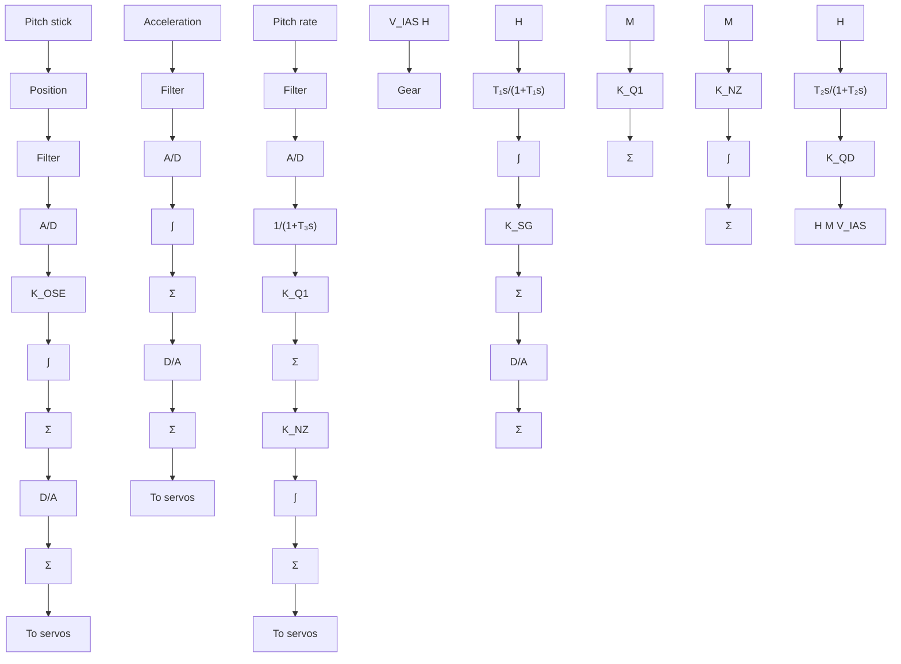

The error signal is thus positive if the fuel-air ratio is low (lean mixture) and negative when the ratio is high (rich mixture). The error signal is sent to a PI controller whose gain and integration time are set from the scheduling table. The values are set on the basis of load (air flow) and engine speed. The gain schedule is implemented simply by adding entries for the gain and integration time to the table used for feedforward of the nominal control variable. Because of the relay characteristic, there will be an oscillation in the fuel-air ratio. This is beneficial, because the catalytic sensor needs a variation to operate properly. The amplitude and the frequency of the oscillation are determined by the parameters of the controller.

flowchart

Figure 9.16 Simplified block diagram of the pitch control of the autopilot for a supersonic aircraft. The highlighted blocks show the parts of the autopilot where gain scheduling is used.
