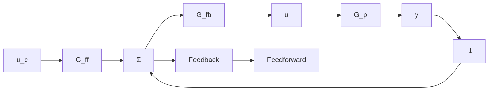

# 10.2 ROBUST HIGH-GAIN FEEDBACK CONTROL

Some design methods deal explicitly with process uncertainties. One powerful method has been developed by Horowitz. This procedure, which has its origin in Bode's classical work on feedback amplifiers, is based on several ideas. The specifications are expressed in terms of the transfer function from command signal to process output. The plant is characterized by its nominal transfer function. For each frequency it is also assumed that the process uncertainty is known in terms of variations in amplitude and phase. A solution is determined in terms of a controller with a feedback $G_{fb}$ and a feedforward $G_{ff}$ , as shown in Fig. 10.1. Such a configuration is called a two-degree-of-freedom system because there are two transfer functions to be determined.

flowchart

Figure 10.1 A two-degree-of-freedom system.

Several other design methods can be used to design robust controllers. One technique is based on LQG design. By adjusting the weighting matrices in the LQG problem, a loop transfer recovery (LTR) is achieved. This design procedure can cope with phase uncertainty at high frequencies. The key idea is to keep the loop gain less than 1 at high frequencies, where the phase error is large.
