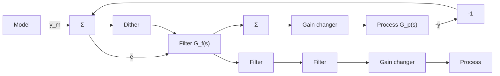

# 10.3 SELF-OSCILLATING ADAPTIVE SYSTEMS

A system that is insensitive to parameter variations can be obtained by using a two-degree-of-freedom configuration with a high-gain feedback and a feedforward compensator (compare Section 10.2). This section introduces an adaptive technique to keep the gain in the feedback loop high by using a relay feedback. Relays combine the properties of high gain and inexpensive implementations. However, relays often introduce oscillations into the system.

The idea of the self-oscillating adaptive system (SOAS) originated in work at Honeywell on adaptive flight control in the late 1950s. The inspiration came from work on nonlinear systems by Flügge-Lotz at Stanford. Systems based on the idea were flight-tested in the F-94C, the F-101, and the X-15 aircraft. (See Fig. 1.2.) The idea has also been applied in process control, but the SOAS has not found widespread use. One reason is that substantial modifications of the basic scheme are necessary to make the systems work well. A characteristic feature of the SOAS is that there is a limit cycle oscillation. The system thus represents a type of adaptive control in which there are intentional perturbations, which excite the system all the time. The SOAS is one of the simplest systems with this property. The SOAS is based on three useful ideas: model-following, automatic generation of test signals, and use of a relay with a dither signal as a variable gain. The key result is that the loop gain is automatically adjusted to give an amplitude margin $A_{m} = 2$ .

flowchart

Figure 10.7 Block diagram of a self-oscillating adaptive system (SOAS).
