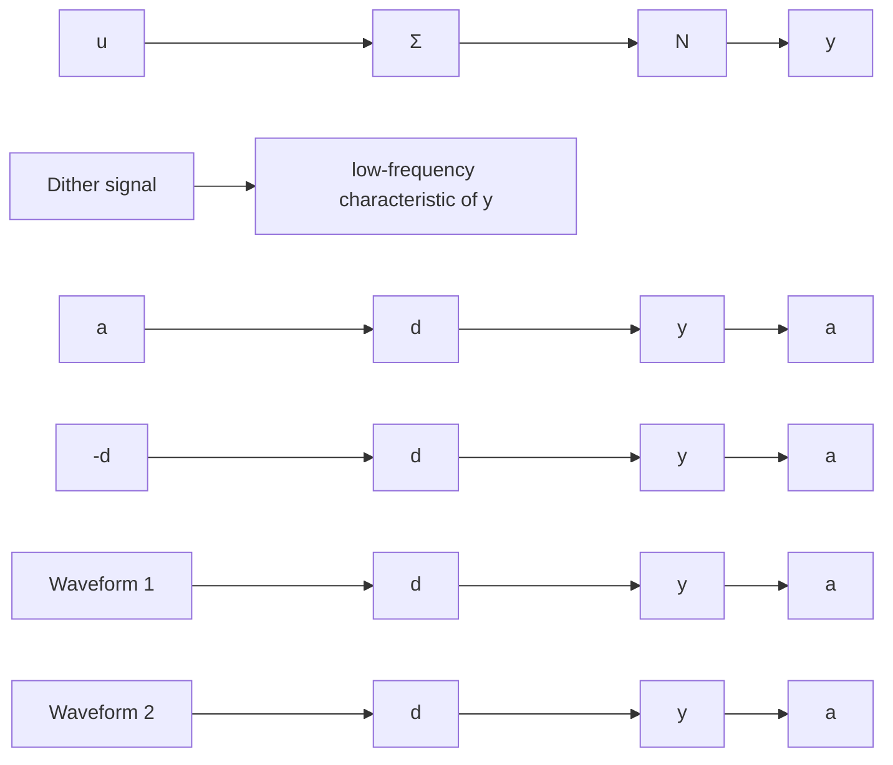

# Dither Signals

In some applications it is desirable to avoid the limit cycle. One idea that has been used successfully is to introduce a variable gain after the relay. The gain is adjusted so that the limit cycle vanishes. In the early applications it was difficult to implement multiplications. A trick that was used to implement the multiplication is illustrated in Fig. 10.10. A high-frequency triangular wave is added to the signal before the relay. With low-pass filtering, the average effect of the additive triangular signal is the same as multiplication by a constant. The constant is inversely proportional to the amplitude of the triangular wave. The triangular wave is called a dither signal. Use of a dither signal is an illustration of the idea that an oscillation may be quenched by another high-frequency oscillation.

flowchart

Figure 10.10 The principle of using a dither signal.
