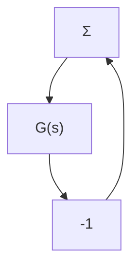

# PROBLEMS

10.1 Determine whether each of the following plants can be stabilized by a linear fixed-parameter compensator when $a \in [-1, 1]$ :

(a) $a / s$ ; (b) $1 / (s + a)$ ; (c) $1 / (1 + as)$ ; (d) $a / (1 + s)$ ;

(e) $a / (1 - s)$ .

10.2 Consider the process

$$G _ {p} (s) = e ^ {- s T} \quad T \in [ 0, 1 ]$$

flowchart

Figure 10.16 The system in Problem 10.3.

(a) Show that the process can be controlled by a controller of the structure in Fig. 10.1 with

$$G _ {f b} (s) = \frac {0 . 6 (1 + s / 1 . 3)}{s (1 + s / 2)}G _ {f f} (s) = \frac {1 + s}{1 + s / 3}$$

(b) Simulate the behavior for changes in the command signal and step disturbances at the output.

(c) Discuss how to make a self-tuning regulator based on pole placement for the process.

10.3 Consider the linear closed-loop system shown in Fig. 10.16 with the same $G(s)$ as in Example 10.2 and with $\alpha = 20$ . Determine the gain $K$ so that the amplitude margin is $A_{m} = 2$ . Simulate the system and determine its step response. Compare this with the step response of the corresponding SOAS in Example 10.2.

10.4 Consider a linear plant with the transfer function

$$G (s) = \frac {k}{s (s + 1) ^ {2}}$$

where the gain k may vary in the range $0.1 \leq k \leq 10$ . Determine the relay amplitude d and a suitable lead network so that the limit cycle amplitude at the process output is less than 0.05 and the rise time to a step of unit amplitude is never less than 0.5. Simulate the resulting design and verify the results.

10.5 Consider the system in Example 10.2. Experiment with a gain changer of the up-logic type. Investigate how a dither signal will influence the performance of the closed-loop system.

10.6 Consider the system in Problem 10.4. Design a gain changer that keeps the limit cycle amplitude at 0.01 for the whole operating range.

10.7 Consider a system with the transfer function

$$G (s) = \frac {k}{s + 1}$$

where the gain k may change in the range 0.1 to 10. Design a servo using the SOAS principle so that the closed-loop transfer function is

$$G (s) = \frac {1}{s ^ {2} + s + 1}$$

independent of the process gain.

10.8 Consider the system in Example 10.4 and assume that the controller (10.10) is used with $\mu = 0.5$ . Assume that the process is changed such that

$$\frac {d x _ {1}}{d t} = a x _ {1} + b u$$
