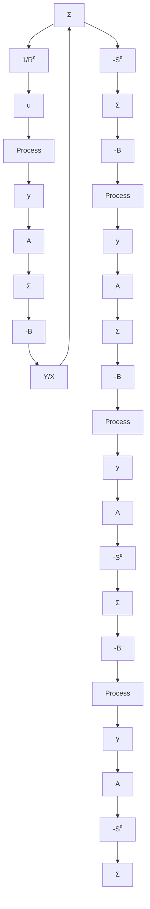

# Youla Parameterization

The Diophantine equation is a key element of pole placement design. This equation has many solutions. If the polynomials $R^{0}$ and $S^{0}$ are solutions of the equation

$$A R ^ {0} + B S ^ {0} = A _ {\mathrm{c}} ^ {0}$$

it follows that the polynomials R and S given by

$$R - X R ^ {0} + Y B \tag {11.2}\boldsymbol {S} = \boldsymbol {X} \boldsymbol {S} ^ {0} - \boldsymbol {Y} \boldsymbol {A}$$

satisfy the equation

$$A R + B S = X A _ {c} ^ {0}$$

If a controller characterized by the polynomials $R^{0}$ and $S^{0}$ gives a closed-loop system with the characteristic polynomial $A_{c}^{0}$ , then the controller

$$(X R ^ {0} + Y B) u = - (X S ^ {0} - Y A) y \tag {11.3}$$

flowchart

Figure 11.6 Block diagram of the closed-loop system with the controller (11.4).

gives a closed-loop system with the characteristic polynomial $X A_{c}^{0}$ . The system is stable if the polynomial X is a stable polynomial but the polynomial Y can be chosen arbitrarily. It thus follows that if the controller $R^{0}u = -S^{0}y$ stabilizes the system Ay = Bu, then all controllers that stabilize the system are given by Eq. (11.3). The equation is called the Youla parameterization of all controllers that stabilize the system. Equation (11.3) can also be written as

$$u = - \frac {S ^ {0}}{R ^ {0}} y + \frac {Y}{X R ^ {0}} (A y - B u) \tag {11.4}$$

This control law is illustrated by the block diagram in Fig. 11.6.
