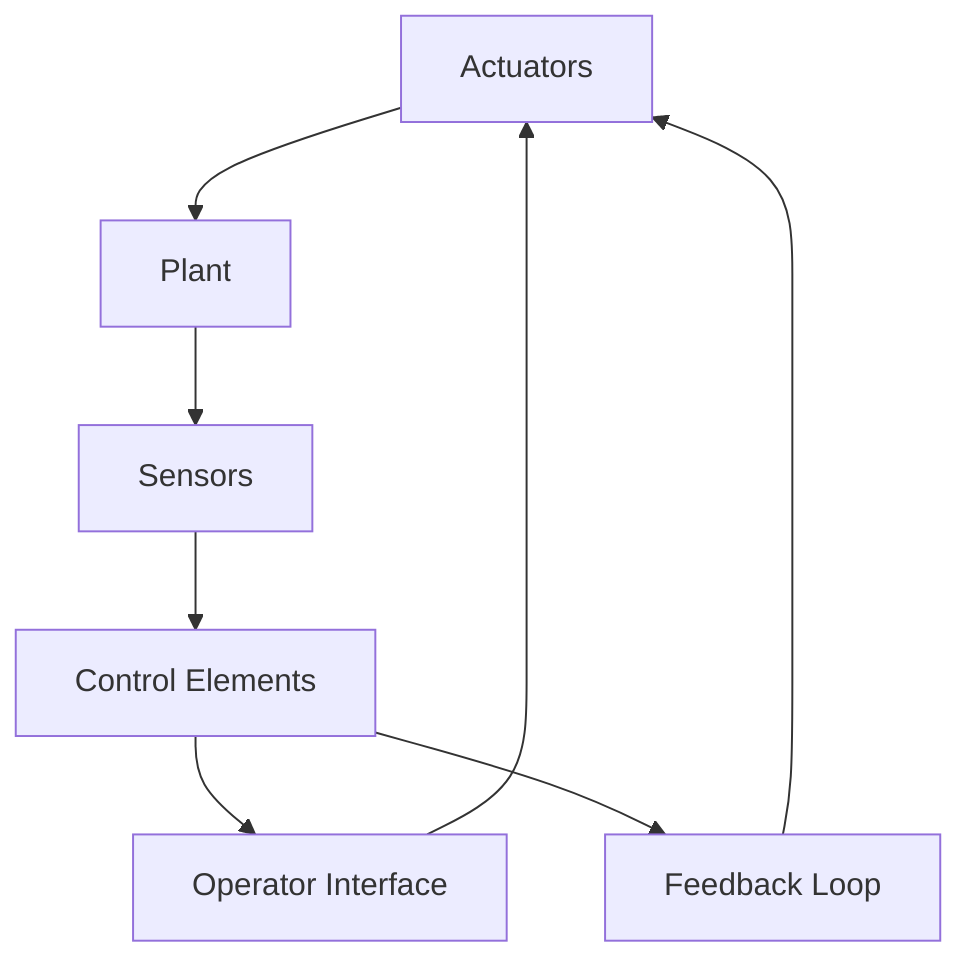

# 1.2 PHYSICAL ELEMENTS OF A CONTROL SYSTEM

Figure 1.1 depicts the elements of a control system. The word “plant” is used generally, to denote the object under control; in this context, an aircraft is a plant.

A plant has output variables, some of which are the ones to be controlled. These variables are measured by sensors. A sensor is basically a transducer, i.e., a device that transforms one type of physical quantity to another, usually electrical. Examples of sensors are tachometers, accelerometers, thermocouples, strain gauges, and pH meters.

A plant must have input variables, which can be manipulated to affect the outputs. The elements that permit these manipulations are called actuators. Control valves, hydraulic actuators, and variable voltage sources are examples of actuators. Actuators are often themselves complete systems, with their own controls.

The role of the control elements is to carry out the control strategy, i.e., to derive command signals for the actuators in response to the sensor outputs. The control elements may be analog devices, but digital control has become prevalent. In the case, the control element includes the A/D and D/A converters and a portion of the computer software.

flowchart

Figure 1.1 ·Physical components of a control system

The operator interface is the window to the outside world that allows human monitoring and intervention. It receives information concerning the inputs and outputs, plus certain status variables from the control elements. It activates displays (dials, strip recorder charts, computer graphics) and triggers alarm indicators (red lights, bells). It also serves as a means of altering the control strategy—for example, by changes in set points or control strategy parameters.

At this point, the reader should be warned that not all systems are physical systems, and that the blocks of Figure 1.1 do not always correspond to physical devices. For example, the plant may be the economy of a nation, with inputs such as monetary and fiscal policies and outputs such as GNP growth rate, unemployment rate, and inflation rate. It is still possible to identify elements that behave functionally like sensors and actuators, but these elements are not physical devices.
