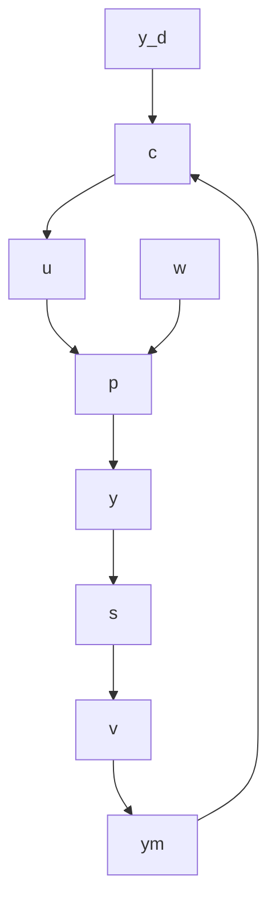

# 1.3 ABSTRACT ELEMENTS OF A CONTROL SYSTEM

The great power of control theory is that it is applicable to so many types of systems. That is why it is taught in so many disciplines, including electrical, chemical, and mechanical engineering; operations research; and economics. The power of control theory derives from its ability to fit a multitude of different problems into a single abstract, mathematical framework.

Figure 1.2 shows the abstract elements of a control system. The plant is represented by P, which specifies the mathematical operations that generate the output variables y from the input variables u and w. Vectors are used to indicate that, in general, there are several inputs and outputs. It is convenient to divide the inputs into two categories: the manipulated inputs u, and the disturbance inputs w.

The sensors are represented by another mathematical operator, S, operating on the output variables y and another set of disturbances, v, to produce the measured outputs, $y_{m}$ .

flowchart

Figure 1.2 Abstract elements of a control system

Finally, the controller is represented by the operator C, which acts on the measurements and the target (or setpoint) variables $y_{d}$ to generate the actuator commands u. The actuators are lumped with the plant in this representation.
