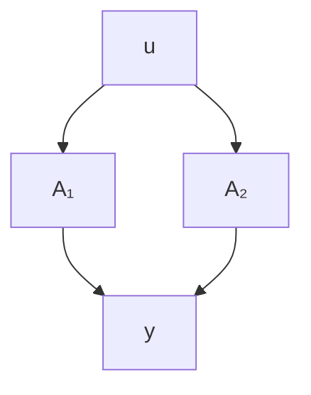
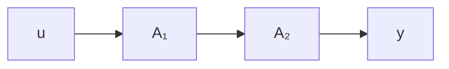
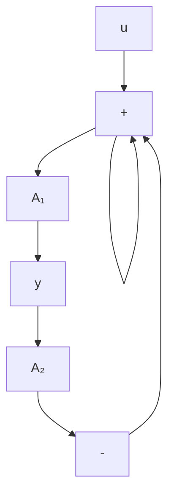

# Problems

2.1 Systems are often described by interconnected blocks, each with its own state equations. Figure 2.16 shows a parallel interconnection of two of these blocks, or subsystems, $\mathcal{A}_1$ and $\mathcal{A}_2$ , with the following descriptions:

$$
\begin{array}{l} \mathcal {A} _ {1}: \quad \dot {\mathbf {x}} 1 = A _ {1} \mathbf {x} 1 + B _ {1} \mathbf {u} 1 \\ \mathbf {y} 1 = C _ {1} \mathbf {x} 1 + D _ {1} \mathbf {u} 1 \\ \mathcal {A} _ {2}: \quad \dot {\mathbf {x}} 2 = A _ {2} \mathbf {x} 2 + B _ {2} \mathbf {u} 2 \\ \mathbf {y} 2 = C _ {2} \mathbf {x} 2 + D _ {2} \mathbf {u} 2. \\ \end{array}
$$

The state of the composite system is $x = \begin{bmatrix} x^{1} \\ x^{2} \end{bmatrix}$ , and its input and output are u and y, respectively. Write state and output equations for the system.

flowchart

Figure 2.16 Parallel interconnection

2.2 Repeat Problem 2.1 for the system of Figure 2.17.

flowchart

Figure 2.17 Series interconnection

2.3 Repeat Problem 2.1 for the system of Figure 2.18.

flowchart

Figure 2.18 Feedback interconnection

2.4 Servo, simplified model Repeat Example 2.1 if the motor inductance $L$ is negligible.

2.5 Servo with flexible shaft The low-velocity side of the gear box in Example 2.1 drives an inertial load through a shaft sufficiently long to exhibit torsional flexibility. The model of Figure 2.19 illustrates the situation: the spring is linear and develops a torque $K(\theta_1 - \theta_2)$ .

a. Model this system. Suggested steps:

i. With $\omega_{2} = \dot{\theta}_{2}$ , $J\dot{\omega}_{2} =$ torque from spring.
