```mermaid
graph LR
    A["F_H, T_H3"] --> B["T_H3"]
    B --> C["Heat"]
    C --> D["T_C1"]
    D --> E["F_C, T_C0"]
    E --> F["T_C2"]
    F --> G["F_C, T_C1"]
    G --> H["T_H2"]
    H --> I["Heat"]
    I --> J["T_C3"]
    J --> K["F_C, T_C2"]
    K --> L["T_H1"]
    L --> M["Heat"]
    M --> N["F_H, T_H0"]
    N --> O["T_H3"]
    O --> P["Heat"]
    P --> Q["T_C1"]
    Q --> R["F_C, T_C0"]
```

Figure 2.23 Lumped model of the heat exchanger

a. Model the system, with the following suggested steps:

i. Let $Q_{C1} = \rho Vc_vT_{C1}$ be the heat contained in the first cold tank. During the interval $t$ to $t + \Delta t$ , a mass $\rho F_C\Delta t$ flows into the tank, at temperature $T_{C0}$ . An equal mass flows out, but at temperature $T_{C1}$ . Calculate the net heat conveyed into the tank by the two flows. Add $k(T_{H3} - T_{C1})\Delta t$ , the heat conducted across the boundary between the last hot tank and the first cold tank. Let $Q_{C1}(t + \Delta t) = Q_{C1}(t) +$ net heat flow during $\Delta t$ .

ii. Let $\Delta t \to 0$ and write a differential equation for $Q_{C1}(t)$ , then for $T_{C1}(t)$ .   
iii. Repeat in similar fashion for all tanks. The same flow rate, $F_{C}$ , applies to all tanks on the cold side, while $F_{H}$ is the constant flow on the

hot side. The six temperatures are state variables, and the inputs are $T_{C0}$ , $T_{H0}$ , $F_{C}$ , and $F_{H}$ .

b. Write the state equations for the following specific values: $V = .2 \, m^{3}$ , $\rho = 10^{3} \, kg/m^{3}$ , $c_{v} = 4180 \, J/kg^{\circ}C$ , $k = 2 \times 10^{5} \, J/^{\circ}C \min$ .   
c. Simulate for $T_{C1}(0) = T_{C2}(0) = T_{C3}(0) = T_{H1}(0) = T_{H2}(0) = T_{H3}(0) = 20^{\circ}\mathrm{C}$ , $F_{C} = 0.05\mathrm{m}^{3} / \mathrm{min}$ , $F_{H} = 0.15\mathrm{m}^{3} / \mathrm{min}$ , $T_{C0} = 20^{\circ}\mathrm{C}$ , $T_{H0} = 80^{\circ}\mathrm{C}$ .

