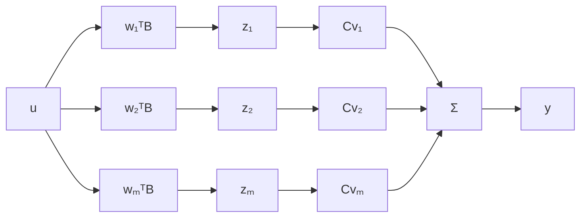

$$
T ^ {- 1} A T = \left[ \begin{array}{c} \mathbf {w} _ {1} ^ {T} \\ \mathbf {w} _ {2} ^ {T} \\ \vdots \\ \mathbf {w} _ {n} ^ {T} \end{array} \right] \left[ s _ {1} \mathbf {v} _ {1} \quad s _ {2} \mathbf {v} _ {2} \quad \dots \quad s _ {n} \mathbf {v} _ {n} \right] = \left[ \begin{array}{c c c c} s _ {1} & 0 & \dots & 0 \\ 0 & s _ {2} & \dots & 0 \\ \vdots & \vdots & \vdots & \vdots \\ 0 & 0 & \dots & s _ {n} \end{array} \right]. \tag {3.62}
$$

The transformed A matrix is diagonal, and its entries are the eigenvalues. The other two quantities required by Equations 3.55 and 3.56 are

$$
T ^ {- 1} B = \left[ \begin{array}{c} \mathbf {w} _ {1} ^ {T} B \\ \mathbf {w} _ {2} ^ {T} B \\ \vdots \\ \mathbf {w} _ {n} ^ {T} B \end{array} \right] \tag {3.63}
$$

and

$$
C T = \left[ \begin{array}{l l l l} C \mathbf {v} _ {1} & C \mathbf {v} _ {2} & \dots & C \mathbf {v} _ {n} \end{array} \right]. \tag {3.64}
$$

Use of these results in Equation 3.55 yields

$$\dot {z} _ {i} = s _ {i} z _ {i} + \mathbf {w} _ {i} ^ {T} B \mathbf {u}, \quad i = 1, 2, \dots , n\mathbf {y} = C \mathbf {v} _ {1} z _ {1} + C \mathbf {v} _ {2} z _ {2} + \dots + C \mathbf {v} _ {n} z _ {n} + D \mathbf {u}. \tag {3.65}$$

This realization in diagonal form has the very simple block-diagram form of Figure 3.7. The state variables are decoupled from each other. They have direct meaning in terms of modes, because they represent the eigenvector content of the original state vector x. The diagram provides a neat interpretation of controllability and observability. The condition for the lack of controllability of the ith mode, $w_{i}^{T}B = 0$ , shows up as a simple decoupling of $z_{i}$ from u. If the ith mode is unobservable, $Cv_{i} = 0$ and $z_{i}$ is cut off from y.

flowchart

Figure 3.7 A system in diagonal Jordan form
