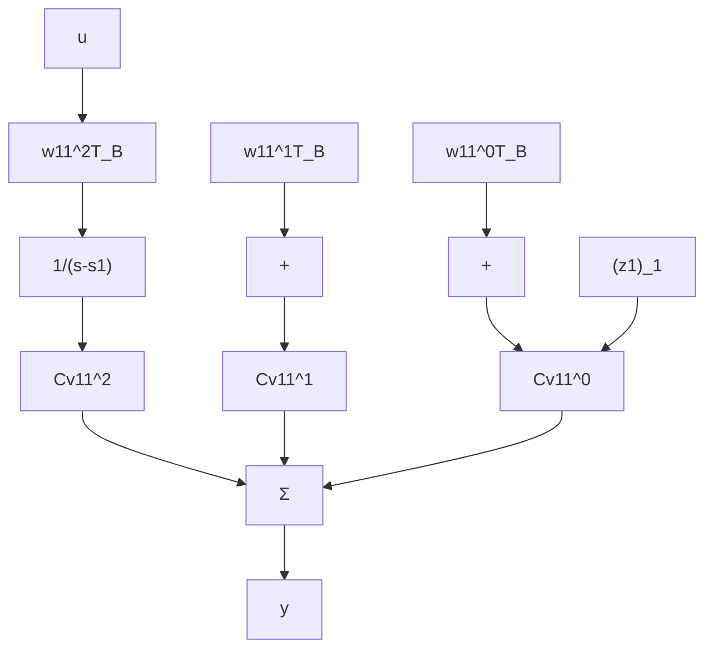

\dot {\mathbf {z}} _ {3} = \left[ \begin{array}{l l} s _ {2} & 1 \\ 0 & s _ {2} \end{array} \right] \mathbf {z} _ {3} + \left[ \begin{array}{l} \mathbf {w} _ {2 1} ^ {0 ^ {T}} B \\ \mathbf {w} _ {2 1} ^ {1 ^ {T}} B \end{array} \right] \mathbf {u}
\mathbf {y} = C [ \mathbf {v} _ {1 1} ^ {0} \mathbf {v} _ {1 1} ^ {1} \mathbf {v} _ {1 1} ^ {2} ] \mathbf {z} _ {1} + C [ \mathbf {v} _ {1 2} ^ {0} \mathbf {v} _ {1 2} ^ {1} ] \mathbf {z} _ {2} + C [ \mathbf {v} _ {2 1} ^ {0} \mathbf {v} _ {2 1} ^ {1} ] \mathbf {z} _ {3}.
$$

The structure is that of parallel blocks, each corresponding to a Jordan block.

The first Jordan block can be used as an example to explore the structure of those parallel blocks. Using Laplace transforms,

$$(\mathbf {z} _ {1}) _ {1} = \frac {1}{s - s _ {1}} [ (\mathbf {z} _ {1}) _ {2} + \mathbf {w} _ {1 1} ^ {0 ^ {T}} B \mathbf {u} ](\mathbf {z} _ {1}) _ {2} = \frac {1}{s - s _ {1}} [ (\mathbf {z} _ {1}) _ {3} + \mathbf {w} _ {1 1} ^ {1 ^ {T}} B \mathbf {u} ](\mathbf {z} _ {1}) _ {3} = \frac {1}{s - s _ {1}} \mathbf {w} _ {1 1} ^ {2 ^ {T}} B \mathbf {u}\mathbf {y} _ {1} = C \mathbf {v} _ {1 1} ^ {0} (\mathbf {z} _ {1}) _ {1} + C \mathbf {v} _ {1 1} ^ {1} (\mathbf {z} _ {1}) _ {2} + C \mathbf {v} _ {1 1} ^ {2} (\mathbf {z} _ {1}) _ {3}.$$

Figure 3.8 shows the relevant block diagram. It is immediately obvious that this block is not controllable if $\mathbf{w}_{11}^{2^T}B = \mathbf{0}$ , because the state variable $(\mathbf{z}_1)_3$ is unaffected by the input. It is also clear that this block is not observable if $C\mathbf{v}_{11}^0 = \mathbf{0}$ , because the output is not influenced by the state variable $(\mathbf{z}_1)_1$ .

Since $\mathbf{v}_{11}^0$ is an eigenvector of $A$ and $\mathbf{w}_{11}^2$ is an eigenvector of $A^T$ , the relation $C\mathbf{v}_{11}^0 = \mathbf{0}(\mathbf{w}_{11}^{2^T}B = \mathbf{0})$ shows, by the eigenvector tests, that the subsystem under study is unobservable (uncontrollable), thus confirming the intuitive conclusion.

flowchart

Figure 3.8 Illustration of a Jordan block for the case of repeated eigenvalues
