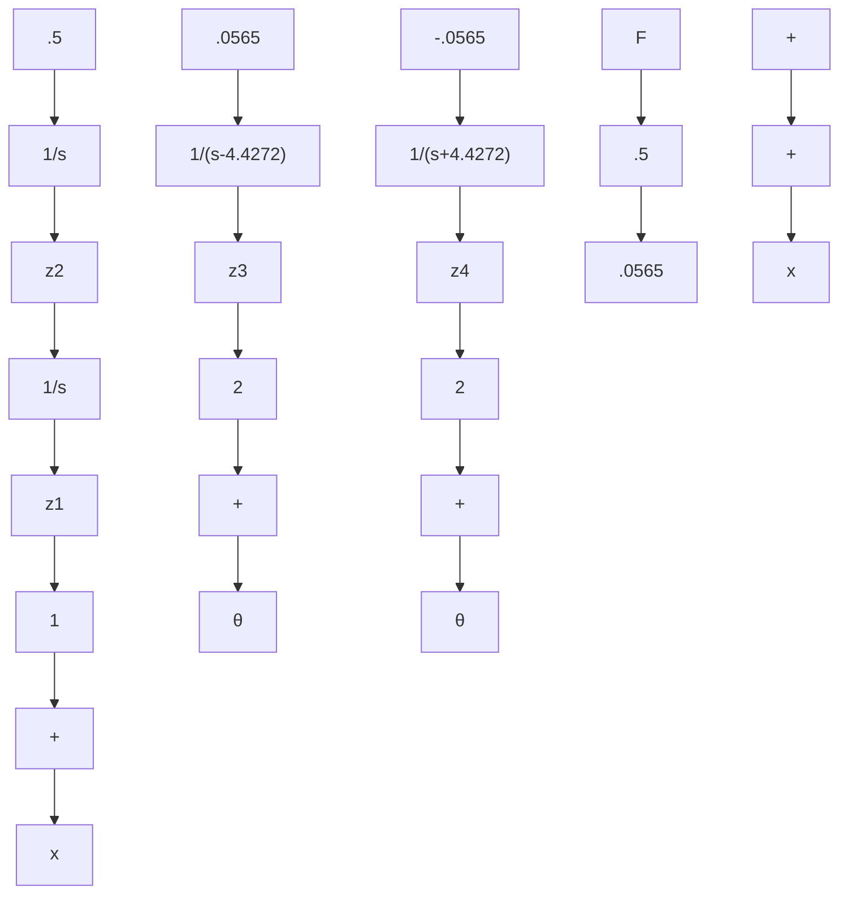

# 3.7.4 The Canonical Decomposition

In the diagonal form, the state variables can be divided into four categories:

- Controllable and observable $(\mathbf{w}_i^T B \neq \mathbf{0}, C\mathbf{v}_i \neq \mathbf{0})$   
- Uncontrollable and observable $(\mathbf{w}_i^T B = \mathbf{0}, C\mathbf{v}_i \neq \mathbf{0})$   
- Controllable and unobservable $(\mathbf{w}_i^T B \neq \mathbf{0}, C\mathbf{v}_i = \mathbf{0})$   
- Uncontrollable and unobservable $(\mathbf{w}_i^T B = \mathbf{0}, C\mathbf{v}_i = \mathbf{0})$

This decomposition, called the canonical decomposition, is illustrated in Figure 3.10. Figures 3.11, 3.12, and 3.13 show the more general structure of this decomposition, which is applicable in the general case of multiple eigenvalues. Figure 3.11 illustrates the decomposition into controllable and uncontrollable parts. In Figure 3.12 the system is split into observable and unobservable parts. Figure 3.13 combines Figures 3.11 and 3.12 in the sense that the controllable and uncontrollable blocks are both further divided into observable and unobservable parts. Note that there is no path, direct or through a block, from the input to either of the uncontrollable blocks. Similarly, the unobservable blocks have no path to the output.

flowchart

Figure 3.9 Block diagram for the Jordan form of the pendulum-and-cart system

The transfer function of the system is that of the controllable and observable block; the other three blocks have no influence. To see this, recall that the transfer function is the transform of the zero-state response. If the initial state is zero, the two uncontrollable blocks remain in the zero state and have zero effect on y. The state of the controllable, unobservable block does move away from zero under the influence of the input, but that has no effect on the output because that block has no connection to y. That leaves only the controllable, observable block.
