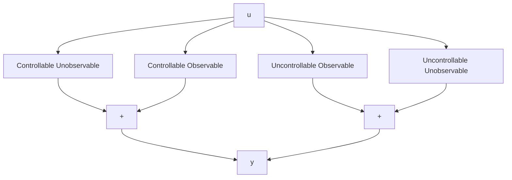
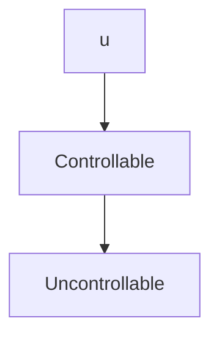
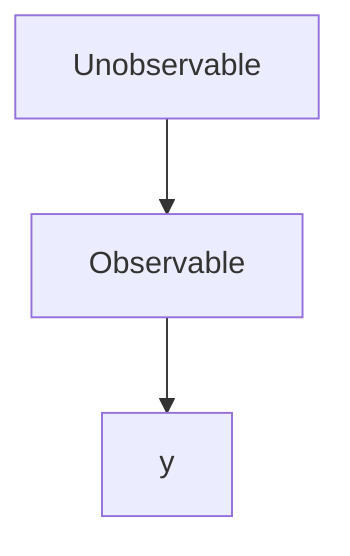
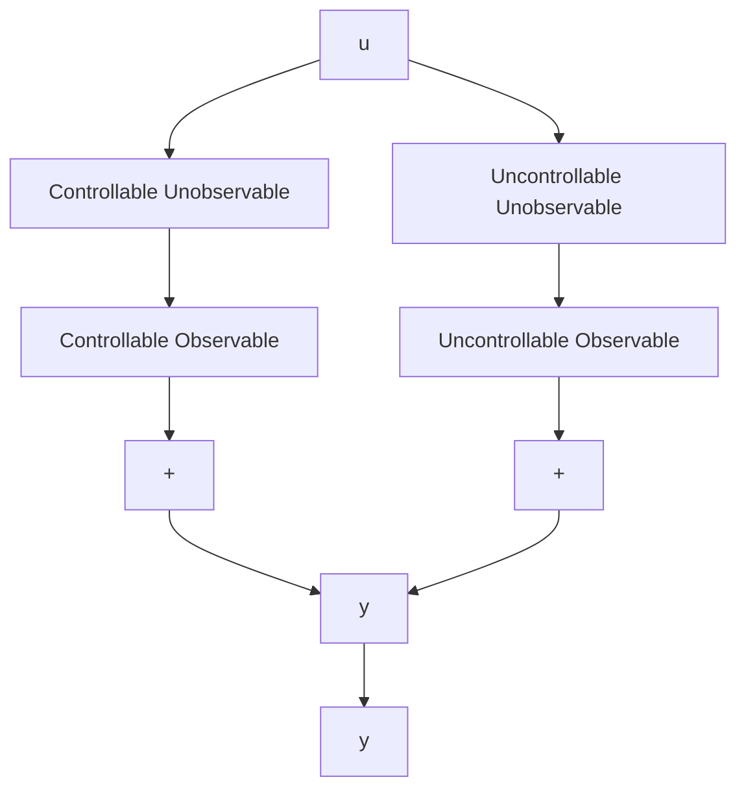

flowchart

Figure 3.10 The canonical decomposition for the case of independent eigenvectors

flowchart

Figure 3.11 Decomposition into controllable and uncontrollable blocks

flowchart

Figure 3.12 Decomposition into observable and unobservable blocks

flowchart

Figure 3.13 The canonical decomposition for the general case
