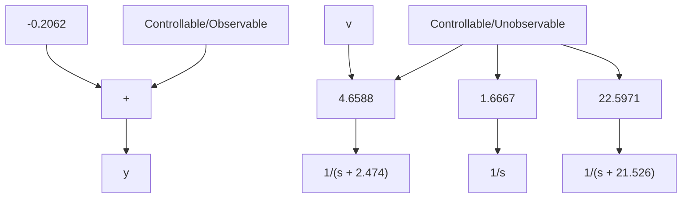

# Example 3.19 (dc Servo)

Repeat Example 3.16 but with the output $y = \omega$ ( $C = \begin{bmatrix} 0 & 1 & 0 \end{bmatrix}$ ). Display the canonical decomposition. (For simplicity, use only the input $v$ .)

Solution The steps are as in Example 3.16, up to

$$
C T = \left[ \begin{array}{c c c} 0 & 1 & -. 2 0 6 2 \end{array} \right].
$$

Figure 3.14 displays the canonical decomposition.

flowchart

Figure 3.14 Canonical decomposition of the dc servo

