# 3.7.5 Minimal Realizations

The equations

$$\dot {x} _ {1} = - x _ {1} + uy = x _ {1} \tag {3.75}$$

describe a realization of the transfer function $1 / (s + 1)$ . A different realization of the same transfer function is given by

$$\dot {x} _ {1} = - x _ {1} + x _ {2} + u\dot {x} _ {2} = - 2 x _ {2} \tag {3.76}y = x _ {1} + x _ {2}.$$

To see this, recall that the transfer function is equal to the transform of the zero-state output, divided by $u(s)$ . The zero-state solution for $x_{2}$ is clearly $x_{2}(t)=0$ , which reduces Equation 3.76 to Equation 3.75.

```mermaid
graph TD
    A["F"] --> B["1/M"]
    B --> C["+"]
    C --> D["v"]
    D --> E["1/s"]
    E --> F["v"]
    F --> G["1/s"]
    G --> H["x"]
    I["-mg/M"] --> C
    J["(M + m)g/(Ml)"] --> C
    K["1/ml"] --> L["+"]
    L --> M["ω"]
    M --> N["1/s"]
    N --> O["θ"]
    O --> P["y"]
    P --> Q["ω"]
    Q --> R["1/s"]
    R --> S["θ"]
    S --> T["1/s"]
    T --> U["θ"]
    U --> V["1/s"]
    V --> W["ω"]
    W --> X["1/s"]
    X --> Y["θ"]
    Y --> Z["1/s"]
    Z --> AA["θ"]
    AA --> AB["1/s"]
    AB --> AC["θ"]
    AC --> AD["1/s"]
    AD --> AE["θ"]
    AE --> AF["1/s"]
    AF --> AG["θ"]
    AG --> AH["1/s"]
    AH --> AI["θ"]
    AI --> AJ["1/s"]
    AJ --> AK["θ"]
    AK --> AL["1/s"]
    AL --> AM["θ"]
    AM --> AN["1/s"]
    AN --> AO["θ"]
    AO --> AP["1/s"]
    AP --> AQ["θ"]
    AQ --> AR["1/s"]
    AR --> AS["θ"]
    AS --> AT["1/s"]
    AT --> AU["θ"]
    AU --> AV["1/s"]
    AV --> AW["θ"]
    AW --> AX["1/s"]
    AX --> AY["θ"]
    AY --> AZ["1/s"]
    AZ --> BA["θ"]
    BA --> BB["1/s"]
    BB --> BC["θ"]
    BC --> BD["1/s"]
    BD --> BE["θ"]
    BE --> BF["1/s"]
    BF --> BG["θ"]
    BG --> BH["1/s"]
    BH --> BI["θ"]
    BI --> BJ["1/s"]
    BJ --> BK["θ"]
    BK --> BL["1/s"]
    BL --> BM["θ"]
    BM --> BN["1/s"]
    BN --> BO["θ"]
    BO --> BP["1/s"]
    BP --> BQ["θ"]
    BQ --> BR["1/s"]
    BR --> BS["θ"]
    BS --> BT["1/s"]
    BT --> BU["θ"]
    BU --> BV["1/s"]
    BV --> BW["θ"]
    BW --> BX["1/s"]
    BX --> BY["θ"]
    BY --> BZ["1/s"]
    BZ --> CA["θ"]
    CA --> CB["1/s"]
    CB --> CC["θ"]
    CC --> CD["1/s"]
    CD --> CE["θ"]
    CE --> CF["1/s"]
    CF --> CG["θ"]
    CG --> CH["1/s"]
    CH --> CI["θ"]
    CI --> CJ["1/s"]
    CJ --> CK["θ"]
    CK --> CL["1/s"]
    CL --> CM["θ"]
    CM --> CN["1/s"]
    CN --> CO["θ"]
    CO --> CP["1/s"]
    CP --> CQ["θ"]
    CQ --> CR["1/s"]
    CR --> CS["θ"]
    CS --> CT["1/s"]
    CT --> CU["θ"]
    CU --> CV["1/s"]
    CV --> CW["θ"]
    CW --> CX["1/s"]
    CX --> CY["θ"]
    CY --> CZ["1/s"]
```

flowchart

Figure 3.15 Canonical decomposition of the pendulum-and-cart system

The realization of Equation 3.76 has two states. It is termed nonminimal because it is obviously possible to realize the same transfer function with fewer states. The realization of Equation 3.75 is minimal, because there needs to be at least one state equation to generate one pole, and it is not possible to do this with zero differential equations.
