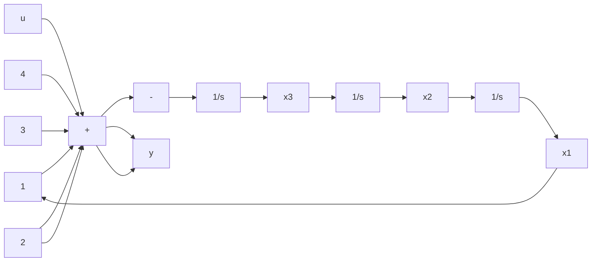
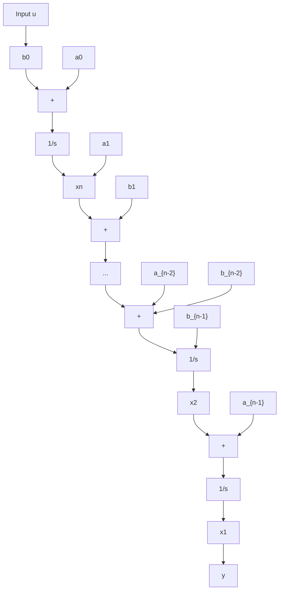

# Example 3.21

Give the realization in controllable canonical form and the associated simulation diagram for $H(s) = (2s + 1)/(s^{3} + 2s^{2} + 3s + 4)$ .

Solution

By inspection, the realization is

$$
\begin{array}{l} \dot {\mathbf {x}} = \left[ \begin{array}{c c c} 0 & 1 & 0 \\ 0 & 0 & 1 \\ - 4 & - 3 & - 2 \end{array} \right] \mathbf {x} + \left[ \begin{array}{l} 0 \\ 0 \\ 1 \end{array} \right] u \\ y = \left[ \begin{array}{l l l} 1 & 2 & 0 \end{array} \right] \mathbf {x}. \\ \end{array}
$$

The diagram is shown in Figure 3.18.

flowchart

Figure 3.18 Controllable canonical form

Another realization is generated by writing Equation 3.77 as

$$
\begin{array}{l} s ^ {n} y = b _ {n - 1} s ^ {n - 1} u + b _ {n - 2} s ^ {n - 2} u + \dots + b _ {0} u \\ - a _ {n - 1} s ^ {n - 1} y - a _ {n - 2} s ^ {n - 2} y - \dots - a _ {0} y \\ \end{array}
$$

or

$$y = \frac {1}{s} (b _ {n - 1} u - a _ {n - 1} y) + \frac {1}{s ^ {2}} (b _ {n - 2} u - a _ {n - 2} y) + \dots + \frac {1}{s ^ {n}} (b _ {0} u - a _ {0} y). \tag {3.82}$$

The simulation diagram is shown in Figure 3.19. Taking the integrator outputs as state variables, we obtain

$$
\begin{array}{l} \dot {x} _ {1} = x _ {2} + b _ {n - 1} u - a _ {n - 1} x _ {1} \\ \dot {x} _ {2} = x _ {3} + b _ {n - 2} u - a _ {n - 2} x _ {1} \\ \dot {x} _ {n} = b _ {0} u - a _ {0} x _ {1} \\ y = x _ {1} \\ \end{array}
$$

•
•
•

flowchart

Figure 3.19 Block diagram for the observable canonical form

or, in matrix form,

$$
\dot {\mathbf {x}} = \left[ \begin{array}{c c c c c} - a _ {n - 1} & 1 & 0 & \dots & 0 \\ - a _ {n - 2} & 0 & 1 & \dots & 0 \\ \vdots & \vdots & \vdots & \vdots & \vdots \\ - a _ {1} & 0 & 0 & \dots & 1 \\ - a _ {0} & 0 & 0 & \dots & 0 \end{array} \right] \mathbf {x} + \left[ \begin{array}{c} b _ {n - 1} \\ b _ {n - 2} \\ \vdots \\ b _ {1} \\ b _ {0} \end{array} \right] u
