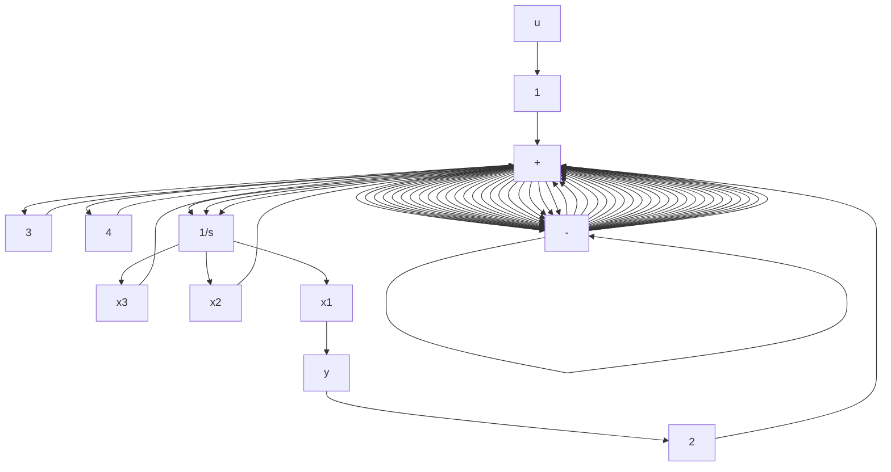

y = \left[ \begin{array}{l l l l l l} 1 & 0 & 0 & \dots & 0 & 0 \end{array} \right] \mathbf {x}. \tag {3.83}
$$

Equation 3.83 is known as the observable canonical form.

Example 3.22 Repeat Example 3.21, but use the observable canonical form.

Solution By inspection, the realization is

$$
\dot {\mathbf {x}} = \left[ \begin{array}{l l l} - 2 & 1 & 0 \\ - 3 & 0 & 1 \\ - 4 & 0 & 0 \end{array} \right] \mathbf {x} + \left[ \begin{array}{l} 0 \\ 2 \\ 1 \end{array} \right] u

y = \left[ \begin{array}{l l l} 1 & 0 & 0 \end{array} \right] \mathbf {x}.
$$

The simulation diagram is shown in Figure 3.20.

It is possible to extend the two canonical forms to the MIMO case, but the result is of somewhat limited usefulness because the realization is usually not minimal. There are better ways to derive MIMO realizations, but they are beyond the scope of this text.

flowchart

Figure 3.20 Observable canonical form
