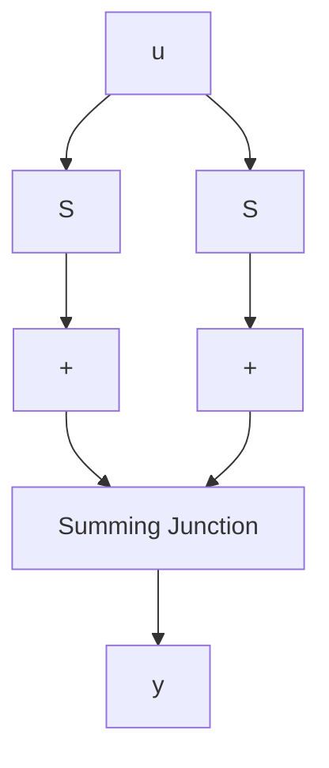

a. Calculate $e^{At}$ and show that there exists a vector $\mathbf{x}^*$ such that $Ce^{At}\mathbf{x}^* = 0$ , for all $t \geq 0$ .   
b. Show that the observability matrix $\mathcal{O}$ is such that $\mathcal{O}\mathbf{x}^{*} = \mathbf{0}$ .   
c. Show that $\mathbf{x}^*$ is an eigenvector of $A$ and that $C\mathbf{x}^{*} = \mathbf{0}$ .

3.24 A second-order system has complex conjugate eigenvalues with nonzero imaginary parts. Show that a system is unobservable if, and only if, the $C$ matrix is identically zero.

3.25 An LTI system has the following A and B matrices:

$$
A = \left[ \begin{array}{l l} 0 & 1 \\ 1 & 0 \end{array} \right] \quad B = \left[ \begin{array}{l} 1 \\ - 1 \end{array} \right].
$$

a. Calculate $e^{At}$ and show that there exists a vector $\mathbf{x}^*$ such that $\mathbf{x}^{*^T}e^{At}B = 0, t \geq 0$ .   
b. Show that the controllability matrix $\mathcal{C}$ is such that $\mathbf{x}^{*^T}\mathcal{C} = 0$ .   
c. Show that $\mathbf{x}^*$ is an eigenvector of $A^T$ and that $\mathbf{x}^{*^T}B = \mathbf{0}$ .

3.26 The system of Figure 3.21 is composed of two identical LTI subsystems $S$ both described by $n$ th-order state equations

$$\dot {\mathbf {x}} = A \mathbf {x} + B \mathbf {u}\mathbf {y} = C \mathbf {x} + D \mathbf {u}.$$

The state vector of the system has the state vector of the first subsystem as its first components and the state vector of the second subsystem as its last n components. Show that the composite system is not observable, and characterize the unobservable states, assuming that each subsystem is observable on its own.

\* H i n t For what initial states will the zero-input solution y(t) be identically zero?

flowchart

Figure 3.21 Parallel interconnection of two identical subsystems

3.27 Show that the system of Figure 3.21 is also uncontrollable. Characterize the uncontrollable states, assuming each subsystem to be controllable on its own.

\* H i n t What vectors of the composite state are reachable from the zero state?
