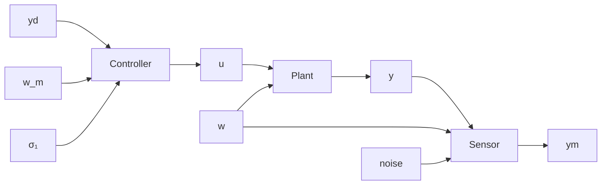

# 4.1 INTRODUCTION

Figure 4.1 presents the system structure, using the terminology of Chapter 1. The plant P is driven by the control input u and the disturbance w. The plant's output, y, is measured by a sensor S. S produces a signal $y_{m}$ , which is intended to be a reasonably faithful copy of the true output y. Another sensor, $S_{1}$ , may be used to measure the plant disturbance w. Finally, the controller, represented by C, produces the plant input u as a function of three signals: the output set point or reference $y_{d}$ , the output measurement $y_{m}$ , and the disturbance measurement $w_{m}$ .

If the plant is linear and time-invariant (LTI), then zero-state linearity dictates that y is a linear combination of the two plant input vectors u and w; i.e.,

$$\mathbf {y} (s) = P (s) \mathbf {u} (s) + P _ {w} (s) \mathbf {w} (s). \tag {4.1}$$

Quite often, it is more convenient to work with $\mathbf{d}(s) = P_w(s)\mathbf{w}(s)$ , the disturbance referred to the output, than with the physical disturbance input $\mathbf{w}$ . An equivalent expression to Equation 4.1, then, is

$$\mathbf {y} (s) = P (s) \mathbf {u} (s) + \mathbf {d} (s). \tag {4.2}$$

flowchart

Figure 4.1 Operator blocks of a control system

Clearly, $\mathbf{d}(t)$ is the sum of the effects of all physical disturbances on the output $\mathbf{y}$ . Figure 4.2 illustrates Equations 4.1 and 4.2.

The sensor S is assumed to have two inputs. The first is the plant output y, and the second is a noise input. The sensor is represented by an LTI model, so

$$y _ {m} (s) = P _ {s} (s) \mathbf {y} (s) + \mathbf {v} (s) \tag {4.3}$$

where v, like d in Equation 4.2, collects the effects on $y_{m}$ of all noise signals. Ideally, $P_{s} = 1$ and v = 0 so that $y_{m} = y$ ; i.e., the measurement is equal to the quantity measured. Equation 4.3 accounts for two types of errors. The transfer function $P_{s}$ covers the sensor dynamics (i.e., the fact that sensors do not respond instantaneously), and v includes other discrepancies between $y_{m}$ and y.
